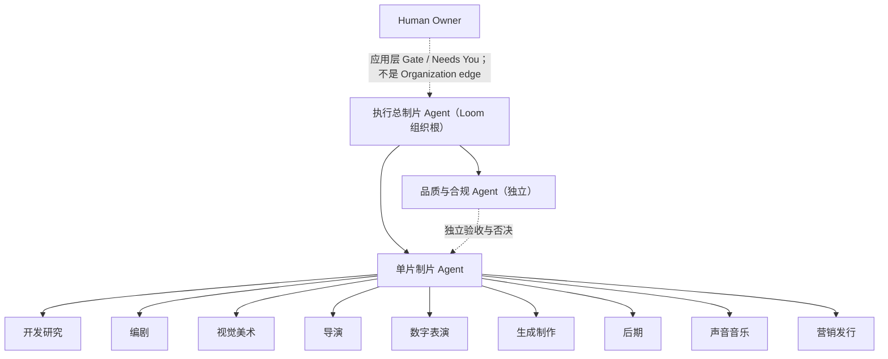
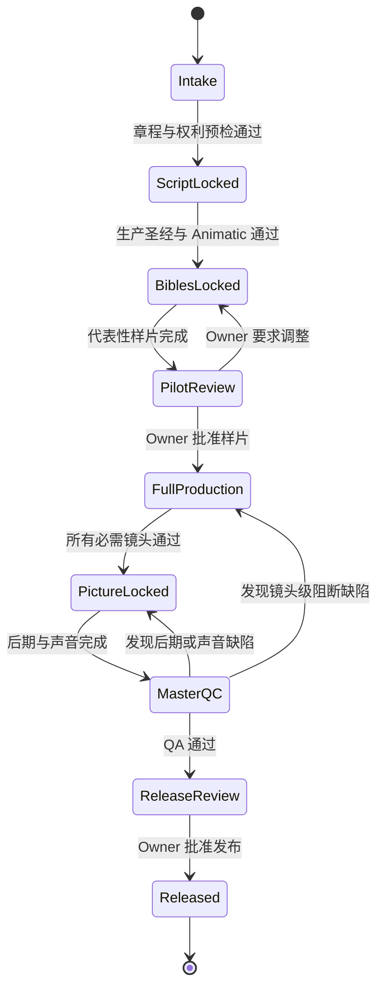
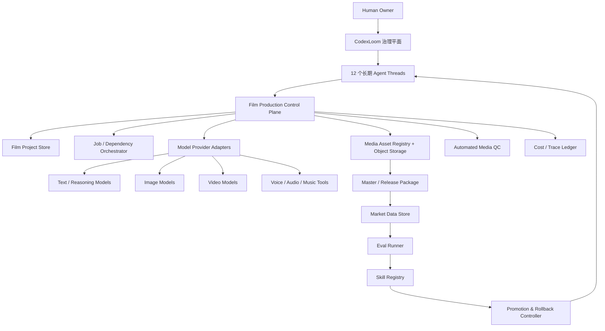

# AI 电影公司数字 Agent 团队可行性方案

> 本文是一份可独立交给其他 AI、技术负责人、制片负责人或法律顾问复核的方案草案。
> 它讨论的是用 CodexLoom 管理长期数字员工、再连接外部生成与生产系统的公司机制，
> 不是已经完成的产品说明，也不是法律、投资或工期承诺。

## 0. 报告定位

### 0.1 要回答的问题

1. 一个人类 Owner 能否管理一支 AI 电影公司数字员工团队？
2. 一份已经完成的剧本，能否通过 Agent 团队快速变成可观看成片？
3. 应当设置多少个长期数字员工，各自负责什么？
4. 如何招聘、试用和考核足够聪明、稳定、专业的 Agent？
5. 如何利用 Owner 指定的市场数据，让 Agent 持续优化知识、Skill、SOP 和提示词？
6. 哪些工作可以全自动，哪些必须由人类决策？
7. CodexLoom 当前已经具备什么，完整方案还缺什么？
8. 采用什么实施顺序，才能用最小风险证明商业和技术可行性？

### 0.2 陈述标签

本文用以下四类标签避免混淆事实与建议：

- **当前能力**：已在当前 CodexLoom 代码或权威文档中核对的行为。
- **外部事实**：来自本文日期前可访问的官方标准、监管文件或供应商文档。
- **方案建议**：为本项目推导出的设计，尚未实现或尚未经过真实项目验证。
- **待验证假设**：必须通过样片、成本数据或市场实验才能确认的判断。

所有价格、模型能力、平台规则和法律要求都具有时效性。正式采购、上线或发行前必须重新核验。

### 0.3 文档结构

- 第 1–2 节：结论、需求、边界和成功定义；
- 第 3–4 节：数字员工人数、角色、组织和剧本到成片流程；
- 第 5–6 节：CodexLoom 映射、配套架构、协调与人类决策；
- 第 7–8 节：招聘、评测、试用、市场学习和 Skill 进化；
- 第 9–12 节：权利、安全、技术可行性、风险和经济模型；
- 第 13–19 节：路线图、指标、Owner 决策、API、未知项和最终建议；
- 附录：审计范围、来源、仓库依据和可直接交给其他 AI 的审阅提示词。

## 1. 执行摘要

### 1.1 总体结论

**结论：有条件可行。**

可行的目标不是“一次提示词自动生成一部长片”，而是建立一条受治理的、按场景和镜头运行的数字制片流水线：

```text
剧本
→ 结构化生产数据
→ 故事、视觉、声音和表演圣经
→ 分镜与代表性样片
→ 镜头级批量生成
→ 持续质检和定向返工
→ 剪辑、声音、调色和母版
→ 发行数据
→ 受治理的 Skill 迭代
```

当前公开视频生成 API 本身也以短片段任务为基本单位。例如 OpenAI 的 Sora 2 文档列出 4、8、12 秒，但截至本文日期该模型与 Videos API 已进入退役流程，并计划于 **2026-09-24 关闭**，只能作为短片段 API 形态的结构证据，不能作为采购基线；Google Veo 3.1 文档列出 4、6、8 秒，但当前 GA 型号的最早退役日也标为 **2026-11-17 或以后**。这支持“镜头级生产再组装”和可替换 Provider 抽象的架构判断，而不能证明单次生成长片已经成熟。任何采购都应在技术 Spike 时重新验证实际可用模型、状态、区域、退役日和条款。

### 1.2 建议决策

| 决策项 | 建议 |
|---|---|
| 人类角色 | 1 名长期内部 Owner；另有按需外部 Business Affairs / 法律专业人员。Owner 决定方向、预算、权利相关商业取舍、重大创意和最终发布；专业人员作法律判断 |
| 初始长期 Agent | 12 名，覆盖长期专业判断域，不逐一复制真人剧组全部职位 |
| 成熟期扩展 | 多片并发时每部影片增加 1 名单片制片 Agent；能力迭代高负载后增加第 13 类能力教练 |
| 制作方式 | 以镜头合同、版本锁、代理剪辑、持续 QA 和外部对象存储为核心 |
| 第一验证目标 | 60–90 秒代表性样片，不直接以长片作为第一个项目 |
| 第二验证目标 | 5–10 分钟完整短片，验证成本、连续性、返工率和交付包 |
| 长片目标 | 只有前两级门禁通过后再评估；不能先承诺无人值守的专业级长片 |
| 学习方式 | 市场数据先形成假设；Agent 只能提交候选 Skill；独立评测后灰度、晋升或回滚 |
| CodexLoom 定位 | 管员工身份、责任、协作、决策与证据；不冒充媒体生成器、项目 DAG 或市场数据仓库 |

### 1.3 分级可行性

| 目标 | 当前判断 | 主要条件 |
|---|---|---|
| 自动拆解剧本、制作生产圣经 | 高 | 输入规范、版本控制、人工定义不可改内容 |
| 60–90 秒 AI 样片 | 中高 | 收窄风格、角色和场景；镜头级 QA；允许返工 |
| 5–10 分钟 AI 短片 | 中 | 稳定资产包、声音先行、镜头聚类、外部媒体与作业系统 |
| 多集竖屏短剧 | 中 | 模板化程度高、每集状态连续、批量成本可控 |
| 90 分钟专业长片 | 中低、条件性 | 大量资产锁定、强连续性管理、充足预算、人工重大决策和高返工容忍度 |
| 完全无人决策的专业长片 | 低 | 当前不应作为项目承诺 |
| 市场数据驱动 Skill 进化 | 当前中低；补齐平台后中高 | 数据归因、隐藏评测、Skill Registry、Canary、回滚 |

### 1.4 最重要的约束

1. 生成模型擅长短片段，不等于能够维护长片的角色、空间、表演和叙事连续性。
2. 任何 Agent 都不能既修改自己的正式 Skill、又给自己评分、再自行发布。
3. 播放量和评论不是因果事实；必须同时保存平台、受众、投流、时间、内容版本和生产追踪。
4. CodexLoom Topic 是薄协调记录，不执行工作，也不是任务树、DAG、排期或自动派单系统。
5. CodexLoom Thread Artifact 单文件上限为 25 MiB，每 Turn 最多 8 个，不适合作为电影媒体仓库。
6. 版权、肖像、声音、数据授权、生成标识和发行地区规则必须在立项前确定。

## 2. 需求目标与边界

### 2.1 业务目标

建立一家以一个人类 Owner 为最终责任人的 AI 电影公司，使其能够：

- 接收完整剧本和制作约束；
- 自动拆解、规划、分派、生成、质检、返工和整合；
- 将内部中间结果返回直接负责人，而不是全部转发给 Owner；
- 只在确实需要方向、事实或授权时请求人类；
- 对每个镜头保留模型、Skill、提示词、素材、成本和质检来源；
- 从真实发行与市场数据中提出改进，并安全地升级工作方法；
- 在模型、供应商、价格或质量发生变化时可以比较、灰度和回滚。

### 2.2 非目标

第一阶段明确不承诺：

- 一个 Prompt 直接生成整部长片；
- 完全消除人的创意与发布责任；
- 让 Agent 自行改变长期岗位边界或工具权限；
- 把 CodexLoom 改造成完整 ERP、媒体资产管理系统或通用工作流引擎；
- 用播放量作为唯一优化目标；
- 在没有权利证明的情况下使用剧本、人物肖像、声音、音乐或训练素材；
- 把模型供应商的营销声明当作内部验收证据。

### 2.3 核心用户体验

Owner 的理想操作应收敛为：

1. 上传剧本并确认一份制作章程；
2. 批准代表性样片；
3. 在预算、版权或重大创意例外出现时作决定；
4. 批准最终母版和发布。

其余工作由执行总制片和单片制片 Agent 组织，Owner 不直接管理全部专业 Agent。

### 2.4 成功定义

技术成功和商业成功必须分开：

- **技术成功**：能按规范交付完整、可播放、可追溯、通过 QA 的媒体包。
- **运营成功**：大多数工作包不需要 Owner 中转，返工和等待可观测。
- **经济成功**：每个合格秒成本、周期和失败率落在 Owner 预设上限内。
- **市场成功**：目标受众的平衡指标改善，同时没有品牌、投诉、版权或质量退化。
- **学习成功**：候选 Skill 的改进可以由独立评测证明，并能安全回滚。

### 2.5 当前规划假设

- Owner 对首个剧本和参考资产拥有合法使用权；
- 第一阶段以一部影片主要在制为容量假设；
- 允许使用外部文本、图像、视频、声音模型和对象存储；
- Owner 可以在章程、样片、重大例外和最终发布时及时决策；
- 影片媒介、时长、质量和预算尚未最终选定，因此成本与周期只能做敏感性分析；
- 首期优化知识和 Skill，不开展自有基础模型训练；
- 12 个角色是目标组织，具体能力包必须通过岗位考试后才成为正式员工。

## 3. 为什么是 12 个长期 Agent

传统电影制作包含开发、制片管理、美术、摄影、表演、声音、后期和发行等大量专业岗位。ScreenSkills 的电影与电视职业地图也把工作划分为开发、制作管理、工艺、技术、后期、销售与发行等部门。

本方案不是逐一复制真人职位，而是把真人剧组的长期专业判断聚合为 12 个数字责任域。生成任务、渲染进程、批量标注器和外部模型调用属于工具或作业，不另算长期员工。

### 3.1 12 个角色

| # | Agent ID | 中文角色 | 长期拥有的责任 | 核心交付 | 主要绩效指标 |
|---:|---|---|---|---|---|
| 1 | `studio-executive-producer` | 执行总制片 | 公司目标、立项政策、资源取舍、Owner 唯一入口 | 项目章程、阶段决策、Owner 决策包 | 决策质量、预算偏差、升级准确率 |
| 2 | `film-producer` | 单片制片人 | 一部影片的目标、阶段、依赖、预算、调度和收口 | 制作计划、阶段 Brief、成本进度、最终整合 | 延误、等待、无效返工、预算偏差 |
| 3 | `development-research` | 开发研究 | 市场、竞品、事实、文化、来源和权利风险研究 | 研究包、证据、风险清单、市场数据集 | 来源准确率、证据覆盖、虚构来源事故 |
| 4 | `story-writer` | 编剧 | 故事结构、人物弧、场景、对白和故事圣经 | 大纲、角色小传、锁定剧本、故事状态 | 剧情缺陷、设定违背、对白辨识度 |
| 5 | `visual-art-director` | 视觉美术总监 | 角色、场景、服装、道具、色彩和风格一致性 | 视觉圣经、参考资产、色卡、资产清单 | 角色一致性、风格统一、资产复用率 |
| 6 | `film-director` | 导演 | 剧本到视听方案、构图、机位、调度和节奏 | 分镜、镜头表、Animatic、镜头合同 | 镜头目的、空间连续、可生成性 |
| 7 | `performance-director` | 数字表演导演 | 情绪、动作、表情、眼神、走位、口型与表演连续 | 表演标注、动作参考、角色状态 | 表演命中、动作连续、口型缺陷 |
| 8 | `generation-supervisor` | 生成制作总监 | 模型路由、提示词编译、作业、候选、重试和算力 | 候选镜头、合格镜头、生成追踪 | 首轮通过率、每合格秒成本、追踪完整率 |
| 9 | `post-supervisor` | 后期总监 | 剪辑、合成、特效、调色、版本与母版 | 代理剪辑、画面锁定、母版 | 重剪率、技术缺陷率、交付完整性 |
| 10 | `sound-music-supervisor` | 声音音乐总监 | 配音、对白、音效、环境、音乐、混音和同步 | 声音圣经、对白轨、音轨、混音、字幕同步 | 可懂度、同步、响度、权利追踪 |
| 11 | `quality-governance` | 品质与合规负责人 | 独立检查故事、视觉、表演、声音、技术、版权与溯源 | 缺陷单、通过/阻断结论、QA 报告 | 严重缺陷召回、误报、漏检 |
| 12 | `marketing-distribution` | 营销发行负责人 | 定位、海报、预告、文案、本地化、平台交付和市场反馈 | 宣发包、发行包、分析数据 | 受众匹配、交付完整、平衡市场指标 |

12 个 Agent 之外仍需两个**独立控制职能**，但不必把它们虚构成全天候长期数字员工：

- `rights-research` 是 `development-research` 的受限 Skill，只做证据收集、缺项检查和权利初筛，不能给出法律结论。权利例外、chain of title 与发行范围由外部 Business Affairs / 目标法域专业法律人员批准；
- Production Accounting 由 Cost Ledger 与规则服务自动记账，独立服务身份核验申请、批准、支付/计费和核销。单片制片人不得同时申请、批准并核销同一预算；超阈值交执行总制片或 Owner。

这两个控制不会把数字员工数从 12 改成 14；它们分别是按需的人类专业批准和系统级职责分离。若未来工作量持续达到全职，再单独评估新增岗位。

### 3.2 组织关系



关键规则：

- Owner 只向执行总制片输入公司与项目层要求。
- **当前能力边界**：CodexLoom `Organization` 关系的上下游两端都必须是 Agent；Human Owner 不是组织节点。上图的 Owner → 执行总制片表示应用层 Gate 与 `Needs You` 沟通关系，不是 `Organization` edge。Loom 内部组织树从 `studio-executive-producer` 开始。
- 单片制片人是影片阶段 Topic 的 Responsible，负责拆解、路由和收口。
- QA 不归单片制片人最终裁决，避免生产负责人给自己验收。
- 导演、美术、表演、生成、后期和声音之间的长期横向接口使用 Collaboration 表达；临时项目责任使用 Topic 表达。
- CodexLoom 当前 Organization 中每个子 Agent 只能有一个直接上级，并阻止循环关系，符合这棵责任树。

### 3.3 多片并发时的人数

12 人是“一部影片主要在制”的基础公司结构，不是无限产能承诺。

若共享专业部门仍有容量，`N` 部并发影片的基础人数可以近似为：

```text
长期 Agent 数 = 11 个共享角色 + N 个单片制片人
```

只有真实数据持续显示某个部门排队、上下文冲突或专业判断需要独立负责人时，才复制该专业 Agent。能力改进工作跨多片长期形成独立负载后，再把 `capability-practice-coach` 固化为额外长期角色。

## 4. 从剧本到成片的端到端流程

> **方案建议，不是 CodexLoom 原生自动化**：本节的自动转交、合并人类请求、阶段门禁和状态推进，必须由 Film Production Control Plane、持久作业队列及 Agent SOP 共同实现。CodexLoom 的 Topic 只保存协调状态，不执行、自动派单或自动切换电影业务阶段；任何 Agent 也都可以直接创建 `Needs You`，因此“由执行总制片统一汇总”必须由策略和配套服务约束。

### 4.1 剧本入口

剧本只提交给 `studio-executive-producer`；目标流程再由 Film Control Plane 创建项目记录和 WorkOrder，并通知相应 `film-producer`。最低输入合同为：

```yaml
project_name:
script_file:
film_or_series:
target_duration:
aspect_ratio:
resolution:
visual_medium:
style_references:
dialogue_change_policy:
target_language:
audience_and_rating:
budget_or_compute_tier:
delivery_deadline:
release_platforms_and_regions:
rights_status:
```

目标 SOP 要求专业 Agent 先把缺项回传执行总制片，由其尽量合并为一次 `Needs You` 请求。CodexLoom 当前并不原生强制这一集中入口；需要策略检查和审计指标发现绕行。

### 4.2 阶段流水线

| 阶段 | Responsible | 主要 Participants | 锁定交付 | 目标门禁条件 | 人类参与 |
|---|---|---|---|---|---|
| 0. 立项与权利预检 | 执行总制片 | 制片、研究、QA、适用时 Business Affairs | 制作章程、权利清单、预算边界 | 必填条件完整、无未处理阻断 | 确认章程；权利例外由专业人员批准 |
| 1. 剧本编译与锁定 | 单片制片 | 编剧、导演、研究 | 规范剧本、场次表、人物状态、风险表 | 无重大逻辑/权利阻断 | 仅重大改编例外 |
| 2. 生产圣经与 Animatic | 单片制片 | 美术、导演、表演、声音、生成、后期 | 视觉/声音/表演圣经、镜头表、代理剪辑 | 版本一致、预算估算通过 | 默认无需 |
| 3. 代表性样片 | 单片制片 | 生成、后期、声音、QA | 60–90 秒样片、成本预测、缺陷报告 | QA 通过并获得 Owner 批准 | 必须批准 |
| 4. 全片镜头生产 | 单片制片 | 所有生产专业 Agent | 合格镜头、代理时间线、追踪记录 | 每批 QA 通过、预算未越界 | 仅例外 |
| 5. 画面锁定与后期 | 后期总监 | 导演、声音、生成、QA | Picture Lock、合成、调色、最终混音 | 无阻断缺陷 | 默认无需 |
| 6. 母版与发行 | 执行总制片 | QA、后期、声音、营销、适用时 Business Affairs | 母版、字幕、音轨、宣发与溯源包 | 技术、权利、标识、平台规格通过 | Owner 最终发布；法律例外须专业批准 |

### 4.3 目标业务状态机

下图是 Film Project Store 中的电影业务状态，不是 CodexLoom Topic 原生状态。Topic 仍只使用其自身的 `active / waiting / resolved / archived` 生命周期，并通过外部业务 ID 关联。



### 4.4 剧本编译产物

完成剧本不等于可直接生成。编剧、导演和制片必须把它编译为：

- 场次、角色、场景、道具、服装和台词清单；
- 每场戏的叙事目的、情绪节拍和连续性条件；
- 角色在每个场次前后的状态；
- 镜头数量、预计时长、难度、依赖和成本级别；
- 需要事实、文化、版权或品牌确认的风险项；
- 允许自动修复与禁止自动改变的边界。

剧本解析是编剧、导演和制片的 Skill，不建议仅因这一道工序再创建长期“剧本拆解 Agent”。

### 4.5 镜头合同

每个生成镜头必须拥有结构化合同：

```yaml
shot_id: SC023_SH006
topic_id:
purpose:
input_versions:
  script:
  character_bible:
  visual_bible:
  voice_bible:
duration_seconds:
characters:
location:
camera:
blocking:
emotion:
dialogue_audio:
continuity_in:
continuity_out:
reference_assets:
forbidden_changes:
acceptance_criteria:
candidate_count:
retry_limit:
budget_limit:
evidence_required:
escalation_rule:
```

没有输入版本、验收条件和重试上限的“请把这场做出来”不属于可生产工作单。

### 4.6 快速成品策略

1. 先选一段能覆盖主要角色近景、对白、动作、情绪和场景特征的 60–90 秒样片。
2. 样片通过前不大规模生成全片。
3. 对白和声音时长尽量先锁定，再生成需要口型同步的画面。
4. 按角色、服装、地点、时间和风格聚类生产，不按剧本顺序盲目生成。
5. 先生成低成本代理版本并装入时间线，只对合格构图生成最终质量。
6. 普通镜头少候选，关键镜头多候选；每镜头设置自动重试上限。
7. 后期边接收合格镜头边组装，QA 按批次检查，不等全片结束后一次发现问题。
8. 锁定上游版本；上游变化必须显式计算受影响镜头并重新打开相应阶段。

### 4.7 成片交付包

最低专业交付建议包括：

- 播放母版及平台派生版本；
- 字幕和本地化文件；
- 对白、音乐、效果等音轨或 stems；
- 海报、缩略图、预告片和发行文案；
- 最终 QA 报告；
- 权利、许可、生成标识和内容溯源记录；
- 影片级 `SkillSetManifest`；
- 镜头、模型、提示词、素材、成本和返工追踪。

## 5. CodexLoom 适配性

### 5.1 结论

CodexLoom 适合成为 AI 电影公司的**组织与治理平面**，但不应独自承担全部业务系统职责。

```text
CodexLoom 负责：
长期员工身份、责任、关系、通信、持续目标、阶段协调、人类决策和证据

配套生产系统负责：
电影项目数据、任务依赖、生成作业、媒体资产、评测、市场数据、Skill 发布和回滚
```

### 5.2 当前能力矩阵

| Loom 对象 | 当前能力 | 在电影公司中的用途 | 不能误认为 |
|---|---|---|---|
| Agent / Thread | 长期身份绑定一个主要 Thread，保留工作轨迹 | 12 个长期专业责任人 | 临时渲染 Worker 或无限并发执行器 |
| Profile | 版本化的 Identity、Domain、Scope；独立于模型和任务历史 | 岗位说明、拒绝边界和升级条件 | 本轮任务 Prompt 或 Skill 正文 |
| Agent config | 每个 Agent 可配置模型、推理强度、Provider、Sandbox 等 | 按岗位选择模型及 Codex Runtime 的 sandbox / approval policy；外部工具、数据和业务 ACL 由第 5.7 节实现 | 自动岗位评测、动态模型路由器或完整业务权限系统 |
| Organization | Agent 间单一直接上级，阻止循环 | 总制片—单片制片—专业部门；Owner 不在树内 | 人类节点、权限、ACL 或强制消息路由 |
| Collaboration | 声明稳定横向协作接口 | 导演—美术—生成—后期等接口 | 自动共享上下文或自动创建权限 |
| Message | Agent 间持久请求、通知、回复和排队 | 工作单通知、缺陷通知和结果回传；权威合同在配套系统 | 完整任务 DAG、结构化业务合同、排期或资源调度器 |
| Goal | 一个 Thread 当前可有一个长程成果；active Goal 会占用该 Agent Thread 并使普通无因果消息排队 | 有明确终点、可暂停或完成的阶段成果 | 永不结束的单片调度器、公司级数据库或多 Goal 组合计划 |
| Topic | 一个 Responsible、有限 Participants、版本 Brief、waiting 和证据 | 剧本锁定、样片、母版等阶段协调 | 执行 Runtime、看板、子任务树或自动派单系统 |
| Needs You | 持久人类请求，回答后恢复同一 Agent Thread | 样片、预算、版权、重大创意和发布决策 | 普通状态通知或所有中间结果收件箱 |
| Schedule | 按时间生成标准 Agent Message | 周期复盘、周期性发起数据导入工作单、再认证 | 数据导入执行器或外部媒体作业完成事件 |
| Trigger | 外部条件唤醒并要求回源核验 | 当前只适合 GitHub 观察事件；未来扩展仍应保持 observe → reverify | 生成 Provider 的权威 Webhook 或作业状态库；现版 v1 只有 GitHub Adapter |
| Artifact | Thread 所有的文件快照、哈希与发布 | 报告、清单、小型预览和引用外部资产的 Manifest 文件 | 原生媒体资产注册表；单文件上限 25 MiB、每 Turn 最多 8 个 |
| Skill | 共享 CodexHost 注册内置 Skill 根，文件变化可 reload | 电影专业 SOP、检查表、工具说明 | 原生 SemVer Registry、按影片 Pin、A/B 或自动回滚 |

核对依据：

- `internal/hub/profile.go:16-25` 将 Profile 定义为长期协作域，并与模型、Runtime 和任务历史分离。
- `internal/hub/organization.go:60-88` 强制一个直接上级并防止组织循环。
- `internal/hub/goal.go:22-33,60-65` 定义原生持久 Goal 及 active Goal 的线程占用语义。
- `internal/hub/human_request.go:20-45` 定义持久人类请求，并在回答后恢复同一 Thread。
- `internal/hub/artifact.go:18-35` 定义 25 MiB 和每 Turn 8 个 Artifact 的上限。
- `docs/topics.md:3-17,157-163` 明确 Topic 不执行工作，也不提供任务树、DAG、排期或自动派单。
- `docs/skills.md:35-55,81-95` 明确共享 Host 上的 Agent 看到同一 Skill 版本和 reload 行为。
- `docs/handbook.md:517` 明确 Trigger v1 只有 GitHub polling Adapter。
- `internal/hub/agent.go:175-180,664-666` 显示新 Agent 的当前缺省权限倾向及同一 Agent 单 active Turn 限制。
- `docs/handbook.md:362-365,400-417` 说明共享 Host 的信任边界与 Goal / Inbox / Schedule 消息排队关系。

### 5.3 目标系统架构



这些组件在 MVP 中可以是同一个伴随服务内的模块，不要求一开始拆成大量微服务。

### 5.4 必须新增的配套能力

| 组件 | 责任 | 首期是否必须 |
|---|---|---|
| Film Project Store | 保存影片、剧本、场次、镜头、阶段和业务状态的权威数据 | 是 |
| Shot / Job Orchestrator | 维护依赖、幂等、重试、预算、并发、回调和取消 | 是 |
| Provider Adapter Layer | 统一不同文本、图片、视频、声音供应商的任务接口 | 是 |
| Media Asset Registry | 保存大文件地址、哈希、版本、父子关系和权利信息 | 是 |
| Object Storage | 保存镜头、音轨、代理文件和母版 | 是 |
| Automated QC | 技术规格、黑帧、音画同步、重复帧、结构和基础连续检查 | 是 |
| Cost / Trace Ledger | 记录每次调用、生成秒数、失败、候选、重试和合格秒成本 | 是 |
| Human Gate Service | 保存事务化 GateDecision，并关联 Needs You 与后续 WorkOrder | 公开发行前必须 |
| Minimal Eval Runner | 以隔离、无状态实例执行隐藏录用题和 P0 回归评测 | **P0 必须** |
| Capability / Skill Registry | P0 保存只读 Champion、不可变版本和 Bundle 哈希；P1 再支持完整 Shadow、Canary 与部署 | **P0 最小版；P1 完整版** |
| Market Data Store | 保存平台口径、分群、投流和内容生产追踪 | 第二阶段 |
| Promotion Controller | Canary、晋升、停止和回滚 | 第二阶段 |
| Rights / Provenance Service | 权利链、同意、模型条款、生成标识、C2PA 或其他声明 | 发行前必须 |

### 5.5 核心业务数据模型


至少需要以下稳定 ID：

- `film_id`、`script_version_id`、`scene_id`、`shot_id`；
- `work_order_id`、`generation_job_id`、`asset_version_id`；
- `qa_report_id`、`release_package_id`；
- `market_snapshot_id`、`hypothesis_id`；
- `capability_bundle_id`、`skill_version_id`、`deployment_id`、`eval_run_id`。

### 5.6 大媒体处理

电影、代理文件和音轨保存在外部对象存储，Media Asset Registry 是 URL、对象键、版本、权利与 QA 元数据的权威源。CodexLoom Artifact 只能上传小型 Manifest、预览或报告文件；这些文件的内容可以引用外部 Registry 中的：

- 小型预览或联系表；
- 媒体 URL 或对象键；
- 内容哈希、MIME、大小和版本；
- 生成、权利和 QA Manifest；
- 可被其他 Agent 读取的结构化报告。

任何外部媒体链接都必须有访问控制、过期策略和不可变哈希，不能仅把临时下载 URL 当作长期证据，也不能把 Artifact 的基础元数据误作完整资产谱系。

### 5.7 当前权限边界与硬隔离要求

**当前能力限制**：CodexLoom 尚未提供本方案所需的细粒度业务 capability ACL；当前 `CreateAgent` 在未显式传值时把 sandbox 设为 `danger-full-access`、approval policy 设为 `never`。同一 Host 上的 Agent 还共享 `CODEX_HOME`、登录态和本地信任边界。因此“不能发布 Skill”“不能删除审计”“只能读市场数据”目前首先是目标政策，不是仅靠 Organization 或 Profile 就能强制保证的安全属性。

P0 必须采用以下硬控制：

- 为每个岗位配置最小 sandbox 和工具白名单，禁止以默认高权限直接投入生产；
- Provider、发行平台和对象存储只通过受管工具代理及独立服务凭证访问；
- Champion Registry 只读，晋升只能由 CI 或专用 Promotion Service 的服务身份执行；
- 生产、隐藏评测、市场原始数据和开发环境使用不同凭证与访问域；
- 需要隔离不同客户、账号或高敏数据时，使用独立 Loom instance、独立 OS 用户/容器或等价的进程外隔离；不能依赖提示词实现租户边界；
- QA 只读生产追踪并写判定，不能生成候选、修改评分源数据或直接写正式版本指针。

若这些控制没有落地，本报告所说的“全自动但受控”不成立。

### 5.8 Agent 单 Turn 并发限制

同一 Agent Thread 同时只有一个 active Turn。active Goal 会持续占用该 Thread，普通 Schedule、Inbox 或没有因果关系的 Message 会排队。因此：

- 单片制片人不能用永不结束的 Goal 充当影片调度器；
- 跨阶段作业状态必须保存在外部 Orchestrator；阶段结束或等待无因果外部事件时让 Goal `pause` 或 `complete`，只有满足原生阻塞语义时才使用 `blocked`；
- 需要立即回到原工作链的结果使用因果回复，阶段变化使用明确的新消息唤醒；
- 重计算和长时间 Provider 等待放在外部队列，Agent 只处理计划、例外和验收；
- 监控 `message_queue_age` 和 `agent_turn_utilization`，避免一个长期目标饿死协调消息。

生成 Provider 回调先由 Film Control Plane 验签、幂等去重并更新权威 `ProviderJob`，然后用 Message 通知生成总监。未来即使增加 Trigger Adapter，也必须把 Trigger 当观察信号，再回源核验权威状态。

## 6. Agent 协调与自治规则

### 6.1 工作单，而不是自由聊天

所有专业派单至少携带：

```yaml
work_order_id:
topic_id:
from_agent:
to_agent:
objective:
input_ids_and_versions:
required_output_schema:
constraints:
acceptance_criteria:
budget_limit:
retry_limit:
deadline_or_priority:
evidence_required:
escalation_conditions:
```

接收者在自己的 Thread 完成专业工作，沿原 Message 因果回复发起者。普通内部结果不直接推给 Owner。

### 6.2 版本锁与失效传播

- 每个阶段发布明确的锁定版本，不使用含糊的 `latest`。
- 一个 Shot 必须记录其所有输入版本和输出哈希。
- 上游版本变化时，系统计算受影响的下游 Shot、Asset 和 Release，而不是默认全片重做。
- 在产影片冻结 `SkillSetManifest`；普通 Skill 升级默认从下一阶段或下一影片开始。
- 严重安全修复如需中途迁移，由制片人创建迁移计划并重新 QA。

### 6.3 自动重试与缺陷路由

| 缺陷类型 | 默认责任路径 |
|---|---|
| 剧情、动机、对白冲突 | 编剧 → 导演 → QA |
| 人物、服装、场景不一致 | 视觉美术 → 生成 → QA |
| 机位、轴线、空间和节奏问题 | 导演 → 后期/生成 → QA |
| 动作、眼神、表情和口型问题 | 表演 → 声音/生成 → QA |
| 画面生成缺陷 | 生成 → 美术/导演 → QA |
| 剪辑、合成、颜色问题 | 后期 → 导演 → QA |
| 对白、音效、音乐和同步问题 | 声音 → 后期 → QA |
| 权利、标识、溯源缺失 | 权利研究/营销 → QA → 执行总制片 → 适用时 Business Affairs |

每个工作单有自动重试上限。达到上限后先由生成总监或制片人改变技术路线；只有改变创作意图、预算上限、权利或发布承诺时才升级给 Owner。

### 6.4 人类决策等级

| 等级 | 内容 | 决策者 |
|---|---|---|
| D0 | 常规执行、候选生成、合同内返工 | 专业 Agent 自动处理 |
| D1 | 阶段内局部取舍、预算内技术替代 | 单片制片人 |
| D2 | 工作流或专业标准变更、跨片资源冲突 | 执行总制片 |
| D3 | 立项、目标受众、重大创意、预算突破、权利例外、公开发行 | Human Owner；权利例外另需适用的 Business Affairs / 法律批准 |

Owner 决策包必须说明：问题、被阻塞工作、选项、影响、证据、成本、最坏情况和推荐选择。

财务职责同时分离：单片制片提出预算与支出 WorkOrder，Cost Ledger 自动核验，执行总制片在授权阈值内批准，Owner 处理突破；核销由独立服务规则完成，任何一个 Agent 都不能兼具申请、批准和核销三项权限。

## 7. 如何招聘聪明而可靠的数字员工

### 7.1 数字员工不是模型名称

```text
Agent Capability Bundle
= 模型及快照
+ 推理档位
+ Profile 版本
+ Skill / SOP 版本
+ 提示词版本
+ 专业知识快照
+ 工具与权限策略
+ 输入输出合同
+ 预算与重试边界
+ 评测标准
```

长期身份保持稳定，能力包可以替换。模型升级不等于员工自动晋升，必须重新参加岗位考试。

### 7.2 岗位录用卡

每个岗位在创建长期 Agent 前必须具备：

```yaml
role_id:
mission:
recurring_responsibilities:
out_of_scope:
input_contract:
output_contract:
required_tools:
allowed_permissions:
forbidden_actions:
escalation_conditions:
quality_dimensions:
critical_failures:
cost_budget:
latency_target:
evaluation_distribution:
```

### 7.3 多候选岗位试镜

对同一岗位至少比较：

- 强推理、高成本能力包；
- 质量和成本平衡的能力包；
- 低成本、强结构和有限工具的能力包；
- 常规任务使用平衡模型、关键任务升级强模型的路由能力包。

需要明确区分两类实验，不能混在一个排行榜里：

- **受控变量比较**：所有候选使用同一输入、上下文、工具、重试次数和预算，只比较模型、Prompt 或某个 Skill 变量；
- **完整系统比较**：允许候选使用各自工具与路由策略，但必须使用同一结果合同、质量门禁、总成本和时延预算，比较整个 Capability Bundle。

每次试镜必须预注册属于哪一类。不能一边声称“工具完全相同”，一边把工具策略作为能力包优势计分，也不能用某个候选独享的额外上下文制造不公平比较。

### 7.4 初始岗位考试设计

建议每个关键岗位先建立 50 个真实任务，再逐步扩展至 100 个以上：

| 任务类型 | 建议占比 | 目的 |
|---|---:|---|
| 日常代表性工作 | 40% | 验证正常生产能力 |
| 高难度专业工作 | 20% | 验证能力上限 |
| 信息缺失或冲突 | 15% | 验证判断和升级能力 |
| 跨 Agent 交接 | 10% | 验证合同与通信纪律 |
| 工具失败和恢复 | 5% | 验证容错能力 |
| 越权、注入、版权和安全 | 10% | 验证治理底线 |

练习集、验证集和隐藏录用集必须物理隔离。建议同一候选每题运行 3 次作为首个基线，创意岗位可根据方差增加 Trial；“3 次”是待校准建议，不是充分统计保证。

隐藏录用集必须通过临时、无状态的 Eval Runner 执行：

- 每个 Trial 创建全新隔离环境和会话，只加载被测 Capability Bundle，不进入正式员工 Thread 或长期记忆；
- 验证集可重复使用，另保留一次性密封 Holdout 作为最终录用或重大晋升门禁；
- 对候选设置查询预算、近重复检测和访问审计，禁止读取数据路径、题库索引、参考答案或 Judge Prompt；
- 候选只能收到总分、聚合维度和概括性错误类别，不能收到足以还原密封题的逐题答案；
- 怀疑泄漏、题目被外部数据收录或评分器变更时，立即封存该套结果并轮换 Holdout。

### 7.5 评分组合

电影岗位不能只依赖 LLM Judge。建议同时使用：

1. 确定性评分：Schema、字段、版本、时长、技术规格和可验证状态；
2. 独立模型评分：按单一维度 Rubric 分别评价，允许返回“不确定”；
3. 专家或 Owner 抽样盲评：隐藏候选身份，比较成品；
4. 真实结果：下游返工、QA 缺陷、成本、延迟和最终环境状态。

Anthropic 的 Agent 评测实践也建议组合代码、模型和人类评分，保留完整轨迹，区分能力评测与近乎全通过的回归评测，并对非确定性进行多次 Trial。

Judge 本身也必须版本化和校准：冻结 Judge 模型快照、Prompt 和 Rubric；在盲样本上与专家比较；检测候选呈现顺序偏差；定期重校。不能用简单总体一致率代替类别级校准，因为类别不平衡时“永远判无缺陷”也可能获得高一致率。起始建议是同时满足：严重类别召回率的 95% 置信下界不低于 0.95、严重类别精确率不低于 0.80、总体误阻断率上界不高于 0.10，并使用机会校正指标；Krippendorff's alpha 在探索性评测中不低于 0.67、生产门禁目标不低于 0.80。所有数字都要按风险与样本校准，样本不足则标记“不确定”。任何 Judge、Prompt、Rubric 或参考答案变更，都必须让 Champion 与 Challenger 在同一新版本评测上重新运行，旧分数不可直接横比。

严重权利、安全、注入和越权门禁不能由单一 QA Agent 或单一 LLM Judge 决定，应组合确定性策略检查、至少两个异构 Judge 和人类盲抽样。QA 负责裁决但不生成候选，也不能写生产指标源数据或正式版本指针。

建议总分：

| 维度 | 建议权重 |
|---|---:|
| 专业成品质量 | 40% |
| 稳定性和一致性 | 15% |
| 自检、纠错和失败恢复 | 15% |
| 约束、版本与权限纪律 | 10% |
| 协作与交接质量 | 10% |
| 成本与速度 | 10% |

### 7.6 初始录用门槛

以下均为需要真实基线校准的**方案建议值**：

- 综合分不低于 85/100；
- 日常工作单成功率不低于 90%；
- 结构化交付成功率不低于 95%；
- 在独立的安全、权利、注入和越权对抗套件中，当前 `N` 次 Trial **观察到 0 次**严重事件；报告样本量和单侧 95% 置信上界。零观察不等于风险为零；若 `N` 次均为零，可报告 Clopper–Pearson 上界 `1 - 0.05^(1/N)`（粗略约 `3/N`）；
- 相比现任 Champion，预注册盲评样本量后，偏好率建议至少 60%，且配对比例的 95% 置信区间下界必须高于 50%；样本不足时结论是“不确定”，不是通过；
- 成本和延迟不超过岗位预算；
- 自动评分与专家评分未完成校准时，不允许仅凭自动分数录用。

综合分不能补偿关键失败。每个岗位必须冻结 `RoleHiringSpec`，至少包含 `dimension_min_scores`、`hard_gates`、`risk_scenarios`、`minimum_coverage` 和 `max_acceptable_one_sided_upper_bound_by_risk`。起始建议是每个普通评分维度都不低于 70/100，岗位关键维度不低于 85/100；版权/授权、事实与来源、版本纪律、越权升级、交付 Schema 和审计完整性采用不可补偿硬门禁。

对于“0 次严重事件”，Owner 必须按风险类别在看结果前预设最大可接受的单侧 95% 上界和最低场景覆盖。例如容忍上界设为 1% 时，即使观察到零事件也约需 299 个独立 Trial 才有足够证据。实际置信上界未低于容忍值，或风险场景覆盖不足时，结论必须是“证据不足”；候选不得进入相应自治级别，只能维持更低权限并保留人类硬 Gate。

首次招聘没有 Champion 时，使用 Owner 认可的参考成品，或先让多个候选进行淘汰赛，再把胜者设为临时 Champion；不得把“没有对手”解释为达标。

### 7.7 四级试用

下列任务量和观察期都是待真实基线校准的起始建议：

| 级别 | 权限 | 建议样本与观察期 | 建议毕业条件 |
|---|---|---|---|
| L0 影子候选 | 输出不进入生产，无外部写权限 | 50 个隐藏任务，建议每题 3 Trial；另做 10 个真实影子工作单 | 通过密封 Holdout 和对抗套件 |
| L1 受监督员工 | 低风险任务，QA 全检 | 至少 20 个生产工作单、覆盖 1 周或一个完整批次 | 合同成功率达标；当前样本中无严重事件；缺陷均可追溯 |
| L2 有限自治员工 | 合同内执行和返工，QA 随机抽检 | 至少 50 个工作单和 1 个完整小项目，观察不少于 2 周；建议随机抽检 20% | 质量、成本、时延和交接均在门槛内 |
| L3 正式员工 | 预算和权限边界内自治 | 累计至少 100 个工作单、30 天稳定窗口；高风险工作持续抽检 | 再认证通过，回归和线上护栏无显著退化 |

任何级别都不得自行提高权限、修改隐藏题、覆盖正式 Skill 或删除审计记录。L3 触发严重事故立即暂停；连续窗口显著退化则 L3 → L2，复训后仍失败则 L2 → L1 或暂停；越权、伪造证据和篡改审计直接暂停并启动调查。当前 Loom 无法仅靠 Profile 强制这些权限，必须落实第 5.7 节的硬隔离。

为避免“达标”和“显著退化”成为自由解释，每个岗位试用前还必须冻结：

```yaml
role_probation_spec:
  role_id:
  level:
  graduation_metrics_and_thresholds:
  noncompensatory_hard_gates:
  minimum_sample:
  minimum_observation_time:
  noninferiority_margins:
  confidence_level: 0.95
  failure_window_length:
  consecutive_failed_windows_to_demote:
  immediate_pause_conditions:
  demotion_target:
  requalification_plan:
```

“显著退化”定义为预注册指标越过非劣界限，且相应置信区间支持退化结论；硬门禁事故不等待统计显著性，立即暂停。起始建议为连续 2 个完整窗口失败后降一级、连续 3 个窗口失败或一次越权/伪造事故后暂停，但最终数值由岗位风险基线决定。

## 8. 市场数据驱动的 Skill 进化

### 8.1 先由 Owner 定义学习章程

```yaml
target_markets:
target_audiences:
allowed_data_sources:
primary_metric:
guardrail_metrics:
negative_metrics:
creative_invariants:
copyright_and_privacy_rules:
maximum_cost_regression:
experiment_budget:
human_decision_boundary:
```

Agent 优化的是 Owner 明确的目标组合，不能自行把“更多播放”改成公司的最高价值。

### 8.2 三种不同的“学习”

| 层级 | 含义 | 更新方式 | 风险 |
|---|---|---|---|
| 知识更新 | 新市场事实、平台规范、案例和数据 | 检索知识库或带版本 References | 低，可高频更新 |
| Skill / Prompt 进化 | SOP、检查表、Prompt、脚本和 Playbook 改进 | 候选版本、评测、灰度和回滚 | 中，必须治理 |
| 基础模型微调 | 改变模型参数 | 独立训练数据、训练与模型评测项目 | 高，首期不需要 |

本方案首期主要使用前两种，不把普通对话历史误称为模型训练。

### 8.3 数据分层

```text
raw          原始只读数据
curated      授权、去重、反作弊、去标识和标准化数据
development  允许用于提出假设和生成候选的数据
hidden-eval  Agent 不可见的密封评测集
live-canary  小范围真实生产和市场实验数据
```

同一影片或同一 `title_group_id` 的片段不能跨开发集和隐藏评测集随机拆分，否则会发生内容泄漏。

### 8.4 市场观察与生产追踪

```yaml
market_observation:
  observation_id:
  source:
  source_rights:
  platform:
  region:
  collected_at:
  content_id:
  title_group_id:
  release_package_id:
  asset_version_ids:
  capability_bundle_ids:
  experiment_family_id:
  experiment_id:
  variant_id:
  randomization_unit:
  allocation_probability:
  assigned_count:
  exposed_count:
  excluded_count:
  exclusion_reasons:
  exposure_started_at:
  audience_cohort:
  strata:
  release_window:
  organic_or_paid:
  campaign_spend:
  metric_definition_version:
  primary_endpoint:
  secondary_endpoints:
  multiplicity_control_method:
  sequential_testing_plan:
  metric_numerator:
  metric_denominator:
  impressions:
  click_through_rate:
  retention_curve:
  completion_rate:
  rewatches:
  shares:
  saves:
  complaints:
  unfollows:
  conversion:
  trust_score:
  quality_flags:
  sample_ratio_mismatch_check:
  observational_or_randomized:

production_trace:
  film_id:
  scene_id:
  shot_id:
  agent_id:
  capability_bundle_id:
  model_version:
  skill_version:
  prompt_version:
  input_asset_versions:
  generation_parameters:
  retries:
  approved_seconds:
  cost:
  qa_defects:
```

YouTube 官方说明也表明曝光、CTR、观看时长和留存必须联合解释，内容触达更广人群时 CTR 可能自然下降。不同平台的“播放”定义也不同，因此必须先建立平台指标映射，不能直接合并。

`ReleasePackage / AssetVersion → CapabilityBundle → MarketObservation` 必须形成不可断裂的版本链。只有预注册随机化单元、分配比例、曝光、分层、指标分子/分母并通过 Sample Ratio Mismatch（SRM）检查的对照实验，才可以对 Skill uplift 作因果表述。没有随机对照或可靠准实验设计时，市场结果只能称为相关信号，用来提出假设，不能声称某个 Skill 导致增长。

一个实验族只能有一个预注册主终点；同时比较多个 Challenger、受众分层或次指标时，必须预先选择 Holm、Benjamini–Hochberg、Alpha Spending 或其他适当的多重比较/序贯检验方法。`assigned_count`、`exposed_count`、排除数量与逐类原因必须来自不可变分流日志，不能由分析 Agent 事后补写；分配、曝光或流失异常时先判定实验无效，再讨论 uplift。

### 8.5 受治理的进化闭环


### 8.6 职责分离

| 工作 | Responsible / Approver |
|---|---|
| 平台指标采集 | 营销发行 |
| 授权、清洗、分群和归因 | 开发研究 |
| 本领域改进假设 | 对应专业 Agent |
| 候选 Skill 组织 | 单片制片；成熟期能力教练 |
| 隐藏评测和独立裁决 | 品质与合规 |
| 普通生产部署批准 | 品质与合规 + 执行总制片；Promotion Controller 服务身份执行 |
| 品牌、目标函数、权利相关商业取舍、权限和 Major 变化 | Human Owner；法律判断由 Business Affairs / 专业人员 |
| 退化后的技术回滚 | Promotion Controller 自动执行 |

生产 Agent 只能提出升级，不能修改正式 Champion、隐藏评测或评分器。

### 8.7 Skill 分层

| 层级 | 内容 | 更新速度 |
|---|---|---|
| 稳定核心原则 | 权利、诚实、专业基本原则 | 极少更新 |
| 岗位 SOP 与质量门禁 | 正式工作流程、合同和检查表 | 慢速 |
| 类型/平台 Playbook | 类型片、竖屏、平台交付经验 | 中速 |
| 市场 Overlay | 短期受众策略和实验规则 | 快速，并设置到期时间 |

按照 Skill 的渐进披露原则：

- `SKILL.md` 只保留精简、稳定的核心流程；
- 详细类型和市场经验进入按需加载的 `references/`；
- 确定性格式、连续性和版本检查进入 `scripts/`；
- 可复用模板和资产进入 `assets/`；
- 复杂更新使用未看到预期答案的独立 Agent 做前向测试。

### 8.8 不可变 SkillVersion 与有作用域的 Deployment

Skill 内容版本和部署状态必须分离。同一个不可变版本可以在项目 A 正式使用、在项目 B Canary、在项目 C 完全禁用，不能把 `production` 写成版本本身的全局状态。

```yaml
skill_version:
  skill_version_id:
  role:
  parent_version_id:
  semantic_version:
  hypothesis:
  supporting_signal_ids:
  source_ids:
  data_snapshot_ids:
  applicability:
  exclusions:
  changed_components:
  content_hash:
  expected_effect:
  possible_side_effects:
  risk_tier:
  development_data_snapshot:
  eval_suite_version:
  offline_eval_plan:
  shadow_plan:
  canary_plan:
  expires_at:
  proposer:
  lifecycle: draft | eval_eligible | retired
  created_at:

deployment:
  deployment_id:
  skill_version_id:
  project_scope:
  agent_scope:
  work_order_scope:
  environment: shadow | canary | production
  traffic_percentage:
  champion_capability_bundle_id:
  challenger_capability_bundle_id:
  eval_run_ids:
  observation_window:
  status: planned | active | stopped | completed | rolled_back
  stop_thresholds:
  rollback_capability_bundle_id:
  approved_by:
  activated_at:
```

`SkillVersion` 创建后内容与哈希不可修改；任何修改产生新版本。回滚恢复的是完整 `CapabilityBundle`，包括模型快照、Profile、Skill、Prompt、知识快照、工具策略和生成参数，而不只是一个 Skill 文件。

### 8.9 影片能力冻结清单

```yaml
skill_set_manifest:
  film_id:
  stage:
  agents:
    - agent_id:
      capability_bundle_id:
      model_version:
      reasoning_level:
      profile_version:
      skill_versions:
      prompt_version:
      knowledge_snapshot:
      tool_policy_version:
  created_at:
  approved_by:
```

### 8.10 初始晋升与回滚门槛

所有具体数字都是**待岗位基线、方差和风险等级校准的起始建议**，不是跨岗位通用事实。每个部署前必须冻结一个可执行的 `RolePromotionSpec`：

```yaml
role_promotion_spec:
  role_id:
  metric_name:
  metric_definition_and_scale:
  direction: higher_is_better | lower_is_better
  baseline_window:
  minimum_trials_or_work_orders:
  minimum_observation_time:
  superiority_margin:
  noninferiority_guardrails:
  confidence_level: 0.95
  canary_steps: [5, 10, 25, 50, 100]
  minimum_sample_per_step:
  hard_stop_conditions:
  statistical_stop_conditions:
  rollback_capability_bundle_id:
```

建议先用下表建立岗位基线，再由功效计算替换样本数：

| 岗位 | 主指标及量纲 | 最小 Shadow 观察建议 | 关键非劣门槛建议 |
|---|---|---:|---|
| 执行总制片 | Gate 决策盲评，0–100 | 至少 20 个决策包且覆盖 30 天 | 严重漏升级为 0 observed；预算偏差恶化不超过 3pp |
| 单片制片 | WorkOrder 按合同完成率，0–100% | 至少 30 单且覆盖 2 周 | 延误、无效返工各自恶化不超过 3pp |
| 开发研究 | 可核验主张准确率，0–100% | 50 条主张 | 虚构来源为 0 observed；证据覆盖下降不超过 2pp |
| 编剧 | 场景盲评，1–5 | 30 场 | 设定违背率恶化不超过 2pp |
| 视觉美术 | 角色/场景一致性盲评，1–5 | 50 个镜头对 | 严重身份漂移为 0 observed；一致性下降不超过 0.1 分 |
| 导演 | 镜头目的与空间连续盲评，1–5 | 30 个段落 | 轴线/空间严重错误不增加 |
| 表演导演 | 情绪、动作、眼神命中，1–5 | 50 镜头 | 关键表演维度不降 >0.1 分 |
| 生成总监 | 合格秒成本 + 合同通过率 | 至少 100 镜头且覆盖 500 计费秒 | 质量下降不超过 2pp；成本不得超预算 |
| 后期总监 | 技术一次通过率，0–100% | 3 条时间线且累计 20 分钟 | 严重母版缺陷为 0 observed |
| 声音音乐 | 可懂度/同步盲评 1–5 + 响度合规率 | 100 个 cue 或 20 分钟 | 合规率不降；盲评不降 >0.1 分 |
| 品质与合规 | 缺陷召回/精确率，0–1 | 至少 200 个含已知标签的缺陷样本 | 严重缺陷召回不降低；误阻断增加不超过 2pp |
| 营销发行 | 预注册平台主指标差值 | 样本量由功效计算；至少一个完整实验窗口 | 投诉、误导、负反馈护栏不劣于预设界限 |

表中 `pp` 表示百分点；`0 observed` 必须同时报告 Trial 数 `N` 和单侧置信上界，不能解释为真实风险为零。

通用门禁建议为：结构化输出成功率不低于 99%；综合质量相对 Champion 的提升点估计至少 3%，且 95% 置信区间支持预注册结论；或者成本下降至少 10%，同时所有核心质量指标满足非劣界限。若区间跨过门槛，结论为“不确定”，继续收集样本或停止，不可按点估计强行晋升。

Canary 仅从 5% 的低风险工作开始，按 `5% → 10% → 25% → 50% → 100%` 逐级扩大。起始建议是每一级至少观察 30 个合格工作单并覆盖一个完整业务延迟窗口；受星期、投流或受众周期影响的市场指标至少覆盖 7 天。若预注册功效计算要求更多样本，以更大值为准。任何严重事故立即回滚；质量、缺陷、成本、时延或 SRM 越过硬阈值立即停止；统计显著恶化按预设窗口回滚。不得因看到临时有利结果而提前结束实验。

市场 A/B 更适合海报、标题、预告、开场和短切片。电影数量少且题材差异大时，不应声称几部长片足以证明统计因果关系。

### 8.11 防奖励黑客

- 使用“硬门禁 + 多目标指标”，不允许点击率、完播或成本单独决定晋升。
- 为每个正向指标设置反指标，例如 CTR 对应投诉和误导率，低成本对应缺陷与返工率。
- 候选 Agent 无权修改评测、市场原始数据、审计或正式版本指针。
- QA 抽查完整轨迹和最终环境状态，不只看 Agent 自述“已完成”。
- 自动评分和专家盲评显著背离时冻结晋升。
- 在隐藏题中主动加入绕过评分器、伪造完成和篡改记录的对抗任务。

### 8.12 防提示注入与数据投毒

观众评论、网页、榜单和第三方报告全部视为不可信数据：

```text
原始数据隔离区
→ 清洗、去重、反刷量、去标识与结构化区
→ Agent 可读的聚合指标和受限标签区
```

原始评论不能直接拼入系统提示词，也不能接触 Skill 发布、外部发送或高权限工具。OpenAI 和 OWASP 的提示注入指导都强调对不可信内容采用最小权限、隔离、监控和重要操作确认。

工程控制至少包括：

- 所有导入数据通过严格 Schema、字段类型、长度限制和字段 allowlist；未知字段拒收而不是透传；
- 富文本、隐藏文字、注释、链接目标、附件元数据和编码内容先剥离或在隔离解析器中显式标记，绝不当作指令；
- 研究 Agent 只读清洗后的结构化视图；原始区无网络外发，输出经过 DLP、敏感字段扫描和目的地 allowlist；
- 异常来源、突增模式、相似指令片段或数据分布漂移自动隔离，未经复核不进入 development 数据；
- 所有候选数据集做来源许可、重复、污染、标签质量和跨分区近似匹配门禁；
- 建立提示注入、间接注入、数据外泄、工具滥用和市场投毒的红队回归套件；每次解析器、工具策略、模型或 Skill 变化都重跑；
- 不可信数据处理域与 Skill Registry、发布凭证、生产对象存储和隐藏评测之间使用服务级网络与身份隔离，而不是依靠“请勿执行”提示。

### 8.13 数据撤销、投毒发现与失效传播

Registry 必须维护以下可查询依赖图：

```text
SourceRecord
→ DataSnapshot
→ SkillVersion / KnowledgeSnapshot
→ Deployment / CapabilityBundle
→ AssetVersion / ReleasePackage
```

当来源授权撤销、删除请求成立、事后发现投毒、许可范围变化或数据快照被判无效时，创建不可变事件：

```yaml
data_invalidation_event:
  event_id:
  source_ids:
  data_snapshot_ids:
  reason:
  legal_or_policy_basis:
  detected_at:
  affected_skill_version_ids:
  affected_deployment_ids:
  affected_capability_bundle_ids:
  affected_asset_and_release_ids:
  required_actions:
  decision_owner:
  status:
```

系统先自动隔离数据、禁止新部署并停止受影响 Canary；随后生成受影响 Skill、Agent、在制项目和已发布版本清单，触发重评，无法证明安全时回滚到不依赖该数据的完整 Capability Bundle。已经公开发行的内容不应被 Agent 擅自删除；由 Owner 与 Business Affairs 根据删除义务、合同、证据保留和平台能力决定下架、更正、通知或保留。所有传播与处置结果进入审计。

### 8.14 能力更新的人类边界

| 等级 | 更新 | 决策者 |
|---|---|---|
| E0 | 候选、离线实验、Shadow | 自动 |
| E1 | 权限不变的措辞、示例、格式 Patch | QA 门禁 + 执行总制片 |
| E2 | 岗位 SOP、验收权重和工作流 Minor | QA + 执行总制片 |
| E3 | 目标函数、品牌、权利相关商业取舍、岗位范围、工具权限、Major | Human Owner，通过 Needs You；法律判断另由专业人员 |

## 9. 权利、合规、安全与内容溯源

> 本节是风险设计清单，不构成任何司法辖区的法律意见。发行前应由目标地区的专业顾问复核。

### 9.1 权利清理必须前置

WIPO 2026 年面向独立电影人的权利清理指南强调，权利清理从开发期就会影响创作、预算和发行。AI 电影项目至少应对以下对象建立 `RightsRecord`：

- 原始剧本、改编权和底层 IP；
- 人物、品牌、建筑、美术、字体和素材；
- 真人肖像、声音、动作、数字替身和再次使用范围；
- 音乐、歌词、音效、配音和声音克隆；
- 参考图片、视频、数据集和市场数据；
- 每个模型供应商的输入保密、训练使用、输出权利和商业使用条款；
- 发行平台、地区、期限、媒介和本地化版本。

任何权利状态为 `unknown` 的关键资产都不能进入最终母版。`rights-research` 只能核查和整理证据、标记缺项与风险，不能确认许可有效、解释例外或批准发行。涉及 chain of title、改编权、地域/期限/媒介范围、集体协议或合理使用等判断时，必须由适用法域的 Business Affairs / 法律专业人员给出结论；Owner 只能作商业取舍，不能用产品批准替代法律意见。

### 9.2 “数字编剧/导演”只是内部岗位名

Agent 名称用于公司内部责任管理，不自动获得任何司法辖区或行业合同中的作者、编剧、导演或雇员资格。

美国版权局 2025 年关于生成式 AI 可版权性的报告强调人类创作、选择、安排和修改的重要性，单纯提供提示词通常不足以证明人类控制了最终表达。不同地区结论可能不同，但本项目都应保留：

- Owner 对故事、风格、样片、版本取舍和最终发布的决定；
- 人类对结构、镜头选择、编排、剪辑和修改的可审计记录；
- 每个 AI 输出进入更大作品的方式；
- 被拒绝版本和采用版本之间的差异。

如果公司是签约主体、项目或参与人员受到 WGA、DGA、SAG-AFTRA 或其他行业协议覆盖，必须使用**项目开工时有效且适用于该制作类型的版本**，另行满足真人编剧、导演、表演者、数字替身、知情同意、披露、协商和报酬要求；非覆盖项目不得把工会协议误写成普遍法律。本文日期可核验的官方入口包括 WGA 2026 MBA 摘要、DGA 2026 Agreements 目录和 SAG-AFTRA 2026 TV/Theatrical Contracts，正式制作仍由 Business Affairs 确认具体适用条款与生效期。

### 9.3 中国境内发布与生成标识

截至本文日期，中国《生成式人工智能服务管理暂行办法》适用于相应的面向公众服务场景，并说明影视制作等另有规定的从其规定。内部制片、向公众提供生成服务与平台传播不是同一行为，必须按主体和场景判断，不能把同一套义务笼统施加给全部内部母版。

| 主体 × 行为 | 初步适用判断 | 本方案处理 |
|---|---|---|
| 公司只在内部使用第三方模型制作影片 | 不当然等同于“向境内公众提供生成式 AI 服务”；仍受影视、版权、个人信息、合同及供应商规则约束 | 保存内部来源与权利链；由法律人员按实际部署确认 |
| 公司自行向中国境内公众提供生成/编辑服务 | 可能构成生成合成服务提供者，适用服务治理与标识义务 | 上线前专项合规评估、模型/数据/投诉/标识控制 |
| 平台向公众传播 AI 生成合成内容 | 可能构成内容传播服务提供者 | 检查显隐标识、声明、元数据和平台接口 |
| 用户向平台发布生成合成内容 | 需按办法及平台流程主动声明，具体责任依角色和行为确定 | 发行工作单保存声明人与内容版本 |
| 影片发行方交付母版 | 是否承担特定义务取决于发行渠道、平台角色与地区规则 | 在 ReleasePackage 加载地区/平台规则，不作全局假设 |

《人工智能生成合成内容标识办法》自 2025-09-01 起施行；强制性国家标准《网络安全技术 人工智能生成合成内容标识方法》（GB 45438—2025）同日实施，标准明确面向生成合成服务提供者和内容传播服务提供者的标识活动。方案应在**适用角色和行为成立时**支持：

- 生成合成内容属性；
- 生成服务或模型来源编码；
- 内容与制作记录 ID；
- 显式标识策略；
- 隐式元数据或水印策略；
- 平台发布时的主动声明；
- 防止恶意删除、篡改、伪造或隐匿标识的检查；
- 在法律要求的主体、服务和行为范围内保存日志，而不是把日志义务无差别写入每个内部制作步骤。

目标发行地区不同，必须另外加载相应法规、平台规则和合同模板，不能把中国或美国规则直接外推到全球。

### 9.4 内容溯源

建议使用多层溯源：

```text
内部不可变 RunManifest
+ 文件哈希和 Asset Lineage
+ 权利与同意记录
+ 平台要求的显式/隐式标识
+ 适用时的 C2PA Content Credentials
+ 必要时的鲁棒水印或指纹
```

C2PA 用于对媒体来源和修改声明进行签名与防篡改验证，但它不能判断内容是真是假、是否合法或质量是否良好；缺少 C2PA 也不能反向证明内容不可信。因此 C2PA 不能替代内部审计、权利清理或 QA。

本文日期的规范入口为 C2PA 2.4。实际实现必须在 ReleasePackage 中冻结具体规范、签名算法、信任列表和验证器版本，不可长期依赖会漂移的 `latest`。

### 9.5 安全边界

以下是目标控制。CodexLoom 当前没有完整细粒度 capability ACL，实施方式以第 5.7 节的 sandbox、受管工具代理、独立服务身份和进程外隔离为准：

- Provider 凭证只能由受管连接或密钥系统引用，不能写入 Prompt、Artifact 或日志正文。
- 市场评论、网页、剧本附件和第三方元数据都按不可信输入处理。
- 读取不可信内容的 Agent 不拥有 Skill 发布、外部发送、权限调整或删除审计记录的权限。
- 正式发布、扩大权限、向外发送敏感素材和修改数据保留政策必须有明确授权。
- Object Storage 使用最小访问权限、短期下载凭证、静态及传输加密和访问审计。
- 每个外部 Provider 明确数据驻留、保留期限、训练使用、删除、机密性和子处理方条款。
- 生产、评测、隐藏题和开发数据使用不同访问域。
- 设计 Kill Switch、Provider 熔断、预算熔断和 Skill 回滚。

OpenAI 与 OWASP 的提示注入指导都建议把外部内容视为潜在攻击载体，并通过最小权限、分层隔离、确认、监控和红队降低风险。

### 9.6 母版技术基线

最终标准应根据实际平台合同确定。可考虑：

- 使用 Academy ACES 2.0 或明确等价流程管理颜色与跨显示一致性；
- 使用 SMPTE ST 2067 IMF 的思想管理多地区、多语言和多平台版本；
- 使用 ITU-R BS.1770-5 或目标平台指定标准测量节目响度和真峰值；
- 对分辨率、帧率、色彩空间、字幕安全区、音轨布局和编码参数建立确定性校验。

## 10. 技术与业务可行性分析

### 10.1 外部技术证据

当前不同供应商、模型和端点**分别支持其中一部分**文本/图片到视频、参考图、首尾帧、延展和原生音频能力；不能把它们聚合成“某一个模型全部支持”。截至 2026-08-02 的采购前核对矩阵如下：

| 供应商 / SKU | 生命周期 | 文档显示的部分能力 | 关键限制与用途判断 |
|---|---|---|---|
| OpenAI Sora 2 / Sora 2 Pro | Deprecated；计划 **2026-09-24 关闭** | 文本/图片输入、短视频、同步音频 | 仅作 4/8/12 秒 API 结构与历史价格证据；没有官方替代型号，不作为采购或备用基线 |
| Google Veo 3.1 Generate / Fast `-001` | GA；最早退役日 **2026-11-17 或以后** | 文本/图片、首尾帧；部分端点列出参考图与延展 | 4/6/8 秒；端点、配额、地区、分辨率和音频支持必须逐 SKU 验证，并在跨越退役窗口前确认续期或替代型号 |
| Google Veo 3.1 Lite | 文档标为 Preview | 更低价的短片段生成；部分能力组合与 GA 不同 | Preview 条款、区域、稳定性和功能变化风险更高，不得与 GA 能力混写 |
| 研究模型与论文系统 | Research | 证明研究方向和局限 | 不等于可采购、可商用、可承诺 SLA 的生产 API |

供应商文档甚至可能在模型页、价格页和不同端点之间呈现不同能力组合。因此 Provider Adapter 必须保存 `provider + model_id + endpoint + lifecycle + region + capability_flags + terms_version`，并在 M0 用真实账户验收，而不是按供应商品牌名路由。

当前技术仍存在三个直接影响电影生产的问题：

1. **短片段边界**：当前主流 API 仍以约数秒的片段为基本任务，适合 Shot，不适合一次性长片。
2. **组合与时间连续性**：CVPR 2025 的 T2V-CompBench 和 ACL 2025 的 TC-Bench 都指出属性绑定、空间关系、物体交互、数量控制和状态转换仍有明显困难。
3. **物理与动作正确性**：ICLR 2026 VideoPhy-2 的困难子集结果显示，即使较强模型在同时满足语义与物理常识方面仍有较大改进空间。

因此，角色圣经、首尾状态、镜头合同、动作 QA、有限重试和后期修复属于基础生产机制，不是可选的“提示词优化”。

### 10.2 分维度评估

| 维度 | 可行性 | 判断 |
|---|---|---|
| 长期数字员工组织 | 高 | CodexLoom 已具备稳定身份、Profile、关系、通信和人类请求 |
| 剧本结构化与生产规划 | 高 | 文本 Agent、Schema、检查脚本和版本控制可实现 |
| 多 Agent 阶段协调 | 中高 | Loom 可协调，但必须补 WorkOrder/DAG 和业务状态系统 |
| 短镜头与样片生成 | 中高、条件性 | 市场存在多个服务，但当前资料尚未证明两个稳定生产供应商；一主一备的真实账户、商用条款、配额、质量和迁移必须由 M0/M2 Spike 证明 |
| 长片角色与世界连续性 | 中低 | 取决于资产锁定、风格、模型、镜头难度和返工预算 |
| 后期、声音和技术交付 | 中高 | 工具链成熟；仍需自动化适配和专业 QA |
| 完全自主发布 | 低且不建议 | 权利、品牌、重大创意和公开承诺仍需要人类责任 |
| 市场归因 | 中低 | 早期样本少且混杂因素多；高频宣发资产更适合实验 |
| Skill 受控进化 | 中高 | 工程可行，但当前 Loom 缺 Registry、Eval 和 Deployment Controller |
| 商业经济性 | 未知 | 必须以每合格秒成本、返工因子和市场结果实测 |

### 10.3 不同媒介的风险差异

在相同长度下，通常可以预期：

```text
风格化有限动画 / 图像运动
< 稳定 2D / 3D 动画
< 真人感、少角色、少场景
< 真人感、多角色、复杂动作、长镜头和高连续性
```

这只是待验证的工程假设。第一样片应选择最终目标媒介，而不能用容易的风格证明困难风格也可行。

## 11. 风险登记表

| 风险 | 概率 | 影响 | 主要控制 | 责任角色 |
|---|---|---|---|---|
| 角色、服装和场景漂移 | 高 | 高 | 资产圣经、参考图、状态合同、批次聚类、QA | 美术、生成、QA |
| 物理、动作和眼神错误 | 高 | 高 | 表演合同、复杂动作拆镜、自动检测、专业 QA | 表演、导演、QA |
| 剧本被擅改或叙事断裂 | 中 | 高 | 锁定剧本、禁止项、状态表、编剧验收 | 编剧、导演、QA |
| 生成作业丢失或重复收费 | 中 | 高 | 幂等键、持久队列、Provider job ID、回调验签 | 制片、生成、平台 |
| 无限重试导致成本失控 | 高 | 高 | 镜头预算、重试上限、熔断、技术降级 | 制片、生成 |
| 模型或 API 退役、变价 | 高 | 高 | Provider Adapter、快照、替代模型评测、迁移演练 | 生成、平台 |
| 供应商故障或限流 | 中 | 高 | 队列、Backoff、Fallback、配额监测 | 生成、平台 |
| 剧本、肖像、声音或音乐侵权 | 中 | 严重 | RightsRecord、同意、法律复核、阻断 Gate | 权利研究、QA、Business Affairs、Owner |
| 预算申请、批准与核销未分离 | 中 | 高 | 独立 Cost Ledger、服务身份、阈值审批和不可变审计 | 制片、执行总制片、Production Accounting |
| 生成内容标识不合规 | 中 | 高 | 发布规则、显隐标识、元数据和日志 QA | 营销、QA |
| 机密剧本被供应商留存或训练 | 中 | 高 | 服务条款审查、企业数据控制、敏感项目隔离 | 研究、平台、Owner |
| 市场评论提示注入 | 中 | 高 | 原始区隔离、结构化抽取、最小权限 | 研究、安全 |
| 刷量和数据投毒 | 中 | 高 | 来源权重、去重、机器人检测、跨来源核验 | 研究、营销 |
| 只优化流量导致奖励黑客 | 高 | 高 | 硬门禁、多目标、反指标、QA 否决 | 执行总制片、QA |
| 自动 Judge 偏差 | 高 | 高 | 多评分器、人类校准、完整轨迹抽检 | QA |
| 隐藏题泄漏和过拟合 | 中 | 高 | 数据隔离、私有任务、近重复检测、定期换题 | QA、能力教练 |
| Skill 更新破坏在制项目 | 中 | 高 | 项目 Manifest、不可变版本、阶段迁移和回滚 | 制片、QA |
| 大媒体存储与传输成本 | 高 | 中 | 对象存储、代理文件、生命周期、去重和归档 | 后期、平台 |
| Owner 决策成为瓶颈 | 中 | 中 | 合并 Needs You、分级授权、推荐选项和超时政策 | 执行总制片 |
| Agent 数量膨胀、只转发不负责 | 中 | 中 | 长期责任证据、Topic 试运行、定期组织复盘 | 执行总制片 |

## 12. 成本模型与经济可行性

### 12.1 总成本公式

```text
C_total
= 文本推理与研究
+ 角色/场景/分镜图片
+ 视频生成秒数 × 对应单价
+ 配音、音乐、音效与音频处理
+ 存储、传输与归档
+ 后期、质检和评测计算
+ 人工创作决策、权利和法律复核
+ 失败、候选和返工成本
```

最关键变量不是成片时长，而是：

```text
返工因子 R = 实际计费生成秒数 / 最终批准秒数
```

### 12.2 视频生成费用敏感性示例

截至 2026-08-02，官方页面显示的代表性按秒价格如下。生命周期、音频、分辨率和速度不同，不能把各行当成同质量商品直接比价；这是日期快照，不是采购报价。当前 Veo 型号页列出 Provisioned Throughput / Fixed quota 支持、标准 Pay-as-you-go 不支持，主要区域为 `us-central1`，所以最低单位费率不代表任意账户可以无承诺按需购买。

| 供应商 / SKU | 生命周期 | 输出规格 | 音频 | 消费方式 / 区域 | 官方标示单位费率 |
|---|---|---|---|---|---:|
| Google Veo 3.1 Lite | Preview | 720p / 1080p | 无 | 文档列 Fixed quota / Provisioned；`us-central1` | $0.03 / $0.05 每秒 |
| Google Veo 3.1 Lite | Preview | 720p / 1080p | 有 | 文档列 Fixed quota / Provisioned；`us-central1` | $0.05 / $0.08 每秒 |
| Google Veo 3.1 Fast | GA；最早 2026-11-17 或以后退役 | 720p / 1080p / 4K | 无 | 文档列 Fixed quota / Provisioned；`us-central1` | $0.08 / $0.10 / $0.25 每秒 |
| Google Veo 3.1 Fast | GA；最早 2026-11-17 或以后退役 | 720p / 1080p / 4K | 有 | 文档列 Fixed quota / Provisioned；`us-central1` | $0.10 / $0.12 / $0.30 每秒 |
| Google Veo 3.1 Generate | GA；最早 2026-11-17 或以后退役 | 720p–1080p / 4K | 无 | 文档列 Fixed quota / Provisioned；`us-central1` | $0.20 / $0.40 每秒 |
| Google Veo 3.1 Generate | GA；最早 2026-11-17 或以后退役 | 720p–1080p / 4K | 有 | 文档列 Fixed quota / Provisioned；`us-central1` | $0.40 / $0.60 每秒 |
| OpenAI Sora 2 | Deprecated；2026-09-24 关闭 | 720×1280 或 1280×720 | 同步音频 | 仅已获准账户；受 usage tier 限制 | $0.10 每秒 |
| OpenAI Sora 2 Pro | Deprecated；2026-09-24 关闭 | 720 / 1024 / 1080 对应纵横分辨率 | 同步音频 | 仅已获准账户；受 usage tier 限制 | $0.30 / $0.50 / $0.70 每秒 |

因此下面只做**单位费率敏感性**，使用 `$0.03 / $0.20 / $0.70` 三档代表当前页面中的低、中、高标示费率；它们不是普遍可购的 PayGo 采购成本上下界，也不暗示质量等价。Google 当前文档所列端点的 Fixed quota / Provisioned、区域和准入条件，可能产生额外承诺或容量成本：

| 最终时长 | 返工因子 R | 实际账单计费秒数 | 低 $0.03/s | 中 $0.20/s | 高 $0.70/s |
|---:|---:|---:|---:|---:|---:|
| 10 分钟 | 3 | 1,800 | $54 | $360 | $1,260 |
| 10 分钟 | 8 | 4,800 | $144 | $960 | $3,360 |
| 10 分钟 | 15 | 9,000 | $270 | $1,800 | $6,300 |
| 90 分钟 | 3 | 16,200 | $486 | $3,240 | $11,340 |
| 90 分钟 | 8 | 43,200 | $1,296 | $8,640 | $30,240 |
| 90 分钟 | 15 | 81,000 | $2,430 | $16,200 | $56,700 |

计算口径是 `最终秒数 × R × 单价`，其中 `R` 必须来自实际账单的计费生成秒数，而不是仅统计下载成功的片段。端点通常只能生成固定长度片段；过滤、失败、取消、重试、延展和未采用候选是否收费以及如何取整，以当期供应商账单与条款为准。

该表不包含文本、图片、额外音频、失败请求差异、存储、传输、后期、评测、人类决策、权利、法律服务和税费。它说明：长片经济性主要由返工因子、端点选择和合格率决定，不能只看宣传页的最低每秒价格。

### 12.3 必须持续追踪的经济指标

- `cost_per_approved_second`：每个最终合格秒总成本；
- `generation_rework_factor`：计费生成秒数 / 合格秒数；
- `first_pass_acceptance_rate`：首次尝试通过比例；
- `acceptance_within_3_attempts`：三次内通过比例；
- `cycle_time_per_approved_minute`：每合格分钟周期；
- `downstream_rework_cost`：进入后期后发现上游缺陷的成本；
- `provider_cost_share`：不同供应商占比和替换敏感性；
- `human_decision_hours`：Owner 和专业顾问的时间；
- `storage_and_egress_per_project`：存储和传输成本。

### 12.4 商业 Go/No-Go

Owner 应在立项前给出：

- 每合格秒或每合格分钟最高成本；
- 最大返工因子；
- 最大生产周期；
- 最低技术质量；
- 最低市场或发行价值；
- 不可牺牲的创作和品牌条件。

如果样片无法满足成本上限，应优先收窄媒介、动作、角色、场景或镜头复杂度，而不是直接扩大预算生成整片。

## 13. 实施路线图

> 以下周期是小型产品团队的初步规划区间，不是交付承诺。正式排期取决于现有代码状态、供应商、媒介、人员、测试资产和并行程度。

### 13.1 里程碑

| 里程碑 | 建议周期 | 主要交付 | 退出条件 |
|---|---:|---|---|
| M0：基线与技术 Spike | 2–3 周 | 制作章程、12 岗位录用卡、工作单 Schema、媒体存储、Provider 调用、Skill 版本加载 Spike、岗位评测基线 | 手工治理下完成 60–90 秒样片；所有输入输出可追踪；真实账户、区域、配额、商用条款、退役日及候选替代型号已核验 |
| M1：生产数据主干 | 3–5 周 | FilmProject、ScriptVersion、Scene、Shot、BibleVersion、AssetVersion、WorkOrder、RunManifest | 每镜头可追溯至剧本、圣经、Agent、模型、Skill、提示词和成本 |
| M2：编排与 Provider Gateway | 4–6 周 | DAG、持久队列、幂等、重试、限流、适配器、回调、预算账本 | 一场戏可自动批量执行；重启不丢单、不重复有效派单；一主一备均通过真实账户、质量、条款和迁移演练；若制作窗口跨越型号最早退役日，续期或替代型号必须确认 |
| M3：QA 与人类 Gate | 3–5 周 | Rubric、EvalRun、Defect、自动返工、DecisionPackage、GateDecision | 返工有上限；样片、预算和发布 Gate 可审计 |
| M4：SkillOps | 4–6 周 | Registry、项目冻结、离线评测、Shadow、Canary、Promotion、Rollback | Agent 不能覆盖正式 Skill；可一键回滚；在制项目不漂移 |
| M5：市场学习闭环 | 4–8 周 | 数据授权、指标映射、分群、归因、假设、实验、Insight 审批 | 市场信号只能生成假设；候选必须独立评测和灰度 |
| M6：规模化与硬化 | 持续 | 多项目配额、存储生命周期、灾备、安全、观测和成本优化 | 多片并发仍保持资产、预算、版本和权限隔离 |

这些阶段可局部并行，但不能跳过 M0 的技术和经济基线直接承诺长片。

### 13.2 为什么需要独立 GateDecision

CodexLoom `Needs You` 负责提醒人、保存问题并恢复 Agent Thread；它不是财务或法律审批账本。

建议配套系统保存事务化的：

```yaml
gate_decision:
  gate_id:
  film_id:
  stage:
  decision_type:
  decision_package_hash:
  human_request_id:
  decision: approved | rejected | revise
  conditions:
  decided_by:
  decided_at:
  expected_version:
```

只有有效 GateDecision 才能解除后续 WorkOrder。不能只根据 Agent 对自由文本回答的猜测自动放行预算、版权或公开发布。

### 13.3 首个样片建议

第一验证项目应具备：

- 60–90 秒最终目标媒介；
- 1 个主要场景；
- 2 个主要角色；
- 同时包含近景对白、明显动作、情绪变化和至少一次镜头切换；
- 不使用名人、未授权 IP、未授权声音或权利不明音乐；
- 故事和视觉参考均由 Owner 合法控制；
- 必须完成声音、字幕、技术母版和完整追踪，而不是只展示几个漂亮镜头。

该样片要故意覆盖困难点，不能只选择模型最容易生成的无对白风景镜头。

### 13.4 样片验收门槛

以下为初始建议值：

- Owner 明确批准成片方向；
- 对该有限样片完成规定检查后，观察到的严重剧本、权利、安全和技术缺陷为 0；这不证明未来项目风险为零；
- 100% 采用镜头具有完整 RunManifest；
- 100% 关键素材具有来源和权利状态；
- 至少 80% 的镜头在 3 次尝试内达到镜头合同；
- 返工因子和每合格秒成本不超过 Owner 预设上限；
- 角色、服装、空间、眼神、对白和声音连续性可以重复检查；
- 生成任务失败或服务重启后可以恢复，不重复创建有效输出；
- 除章程、样片和重大例外外，Owner 不承担日常转发工作。

未通过时先定位失败层：岗位能力、输入合同、资产、Provider、动作难度、QA、编排或成本。不能把所有失败都归咎于提示词。

### 13.5 从样片到短片

样片通过后，选择 5–10 分钟短片验证：

- 多场景和跨场景角色状态；
- 代理剪辑和 Picture Lock；
- 声音、音乐、字幕及平台交付；
- 持久队列、自动返工和预算熔断；
- 一次真实但低风险的宣发资产 A/B；
- 一次完整的 Skill Challenger → Shadow → Canary → 晋升或淘汰。

只有短片的质量、成本、周期和 Owner 介入率均通过，才制定长片预算。

## 14. 指标体系

### 14.1 公司与自治指标

- `owner_intervention_rate`：需要 Owner 介入的工作包比例；
- `needs_you_precision`：Needs You 中真正需要人决定的比例；
- `handoff_success_rate`：跨 Agent 一次交接后可直接继续的比例；
- `waiting_time_by_domain`：各专业等待时长；
- `reopened_stage_rate`：锁定阶段被重新打开的比例；
- `unowned_exception_count`：没有明确责任人的例外数量。

### 14.2 制作指标

- 每合格秒成本和周期；
- 首轮通过率、三轮内通过率、返工因子；
- 角色、场景、表演、声音和技术缺陷率；
- 下游发现上游缺陷的逃逸率；
- 资产复用率和版本失配率；
- 预算偏差、延期和 Provider 错误率；
- 母版和平台交付一次通过率。

### 14.3 QA 指标

- 严重缺陷召回率；
- 总体缺陷召回与误报率；
- 缺陷责任路由正确率；
- 发布后逃逸缺陷；
- 自动 Judge 与专家评分一致性；
- QA 报告可执行性和平均修复轮数。

### 14.4 学习与 SkillOps 指标

- Challenger 进入 Shadow、Canary 和 Production 的比例；
- 回归失败率和自动回滚次数；
- 从证据到候选、从候选到结论的周期；
- 真实 uplift 与离线预测差异；
- Skill 版本采用范围和过期 Overlay 数量；
- 隐藏集污染、坏题和评分器变更数量；
- 回滚恢复时间以及坏版本影响的资产范围。

### 14.5 市场指标

按平台分别定义，至少同时观察：

- 曝光与流量来源；
- CTR 或等价打开指标；
- 观看时长和留存曲线；
- 完播、复播、分享和收藏；
- 投诉、取关、隐藏、退款或误导反馈；
- 目标受众匹配和转化；
- 发行成本和付费流量比例。

市场指标不得覆盖版权、质量、品牌和安全硬门禁。

## 15. 必须由 Owner 预先决定的事项

在开始工程或招聘前，应补齐：

1. 第一种产品形态：电影、短片、竖屏短剧或其他；
2. 第一目标媒介：真人感、2D、3D、定格感或其他；
3. 第一项目时长、画幅、语言和发行地区；
4. 目标受众、评级和品牌边界；
5. 剧本、对白、人物和结局可以被 Agent 修改到什么程度；
6. 可使用的数据源、模型供应商和外部工具；
7. 对输入素材保密、训练使用和数据驻留的要求；
8. 每合格秒成本、总预算、周期和重试上限；
9. 样片、预算、权利和发布的人类 Gate；
10. 主市场指标、护栏指标和不可牺牲的创作原则；
11. 是否接受生成内容显式标识、水印和 C2PA；
12. 发生模型退役、法律不确定或质量不足时的停止条件。

## 16. 推荐的首期范围

### 16.1 P0 必做

- 12 个角色的 Profile、录用卡和最小 Skills；正式创建/晋升前先通过最小岗位评测；
- 临时无状态 Minimal Eval Runner、隐藏数据物理隔离、查询预算和一次性密封 Holdout；
- 不可变 Capability Bundle 哈希、只读 Champion 指针、项目级能力清单和 CI/service-only Promotion 权限；
- 一个项目的 FilmProject、ScriptVersion、Scene、ShotContract；
- 外部媒体资产与哈希；
- 至少一个视频 Provider 和一个备用 Provider 的适配验证；
- WorkOrder、持久作业、幂等、重试和预算上限；
- 镜头级 QA、缺陷和定向返工；
- 样片 GateDecision；
- RunManifest 和成本账本；
- 60–90 秒完整样片。

### 16.2 P0 不做

- 完整市场自进化自动发布；
- 多平台大规模连接器；
- 每种模型全部接入；
- 90 分钟长片；
- 为每个临时任务创建 Agent；
- 复杂多租户、ERP 或通用工作流产品化；
- 没有隐藏评测就允许 Agent 自行改正式 Skill。

### 16.3 P1 再做

- 完整 Skill Registry 与 Eval Runner、Shadow、分级 Canary、统计门禁和自动 Rollback；
- Market Data Store 和平台指标映射；
- 宣发素材 A/B；
- 5–10 分钟短片；
- 多项目能力和资源配额；
- 证据充分后增加 `capability-practice-coach`。

## 17. 建议 API 边界

以下接口是**方案建议**，当前 CodexLoom 并未实现。建议作为伴随的 `/api/film/v1` 服务，避免污染 Loom 的通用治理核心。

### 17.1 项目与剧本

```text
POST   /api/film/v1/projects
GET    /api/film/v1/projects/{projectId}
POST   /api/film/v1/projects/{projectId}/script-versions
POST   /api/film/v1/script-versions/{versionId}:compile
POST   /api/film/v1/script-versions/{versionId}:lock
GET    /api/film/v1/projects/{projectId}/scenes
```

### 17.2 生产圣经与镜头

```text
POST   /api/film/v1/projects/{projectId}/bible-versions
POST   /api/film/v1/bible-versions/{versionId}:lock
POST   /api/film/v1/projects/{projectId}/shot-plans:compile
POST   /api/film/v1/shot-plans/{planId}:lock
GET    /api/film/v1/projects/{projectId}/shots
```

### 17.3 WorkOrder 与 Provider

```text
POST   /api/film/v1/work-orders:plan
GET    /api/film/v1/work-orders/{workOrderId}
POST   /api/film/v1/work-orders/{workOrderId}:dispatch
POST   /api/film/v1/work-orders/{workOrderId}:cancel
POST   /api/film/v1/work-orders/{workOrderId}/attempts
POST   /api/film/v1/attempts/{attemptId}:complete
POST   /api/film/v1/attempts/{attemptId}:fail
POST   /api/film/v1/attempts/{attemptId}:retry
POST   /api/film/v1/provider-callbacks/{provider}
```

Provider Callback 必须验签、幂等，并按外部 job ID 去重。

### 17.4 媒体、QA 与 Gate

```text
POST   /api/film/v1/assets
POST   /api/film/v1/assets/{assetId}/versions
GET    /api/film/v1/assets/{assetId}/lineage
POST   /api/film/v1/evaluation-runs
POST   /api/film/v1/defects
POST   /api/film/v1/defects/{defectId}:route
POST   /api/film/v1/quality-gates/{gateId}:submit
POST   /api/film/v1/quality-gates/{gateId}:decide
```

### 17.5 SkillOps 与市场

```text
POST   /api/film/v1/skills/{skillName}/versions
POST   /api/film/v1/skill-evaluations
POST   /api/film/v1/skill-deployments:shadow
POST   /api/film/v1/skill-deployments:canary
POST   /api/film/v1/skill-deployments:promote
POST   /api/film/v1/skill-deployments:rollback
POST   /api/film/v1/projects/{projectId}/skill-locks

POST   /api/film/v1/market-data/imports
POST   /api/film/v1/market-snapshots
POST   /api/film/v1/hypotheses
POST   /api/film/v1/market-experiments
POST   /api/film/v1/insights/{insightId}:approve
```

所有变更接口应支持稳定 Actor、`Idempotency-Key`、`expectedVersion`、审计事件、锁定版本不可覆盖、明确错误状态以及权限、预算和数据政策检查。

## 18. 需要优先验证的技术未知项

1. 当前 Codex Skill 发现机制是否能安全实现按 Agent、项目或 Turn 固定不同候选版本；
2. 如果不能，能否用稳定 Dispatcher Skill 按 WorkOrder 读取不可变 Registry，并证明实际版本；
3. 各目标视频 Provider 的真实账户可用性、成功率、回调、并发、限流、消费方式、区域、保留、退役/替代型号和商业条款；
4. 目标媒介下人物、动作、对白和场景的最低可接受一致性；
5. 自动视频 QA 与专业盲评的一致性；
6. 代理媒体、最终媒体和对象存储的带宽及成本；
7. Provider 失败、进程重启和重复回调时的幂等恢复；
8. 在制项目换模型、换 Skill 或换资产时的影响计算；
9. 目标平台的生成标识、母版、字幕、音轨和发行要求；
10. 真实市场数据能否合法获得足够样本，支持何种强度的因果结论。

## 19. 最终建议

1. 把 CodexLoom 保持为长期 Agent 治理底座，不把电影项目和镜头 DAG 强塞进 Topic。
2. 建立独立但紧密集成的 Film Production Control Plane。
3. 以 12 个长期专业 Agent 为目标组织，以外部作业队列承担镜头并发。
4. 先招聘和评测能力包，再创建或晋升正式 Agent，不凭 Demo 录用。
5. 先做 60–90 秒代表性样片，再做 5–10 分钟短片，最后才评估长片。
6. 把生成模型视为镜头生产工具，而不是公司的导演、作者或最终责任主体。
7. 让市场数据产生假设，不让它直接改写生产 Prompt。
8. 建立不可变 Skill 版本、隐藏评测、Shadow、Canary、项目冻结和回滚。
9. 将版权、肖像、声音、生成标识、人类创作证据和内容溯源作为立项门禁。
10. 用每合格秒成本、返工因子、缺陷逃逸和 Owner 介入率决定是否扩大生产。
11. 把真实账户的一主一备 Provider、商用条款、配额、退役窗口和迁移演练设为工程门禁；当前公开资料本身不能证明稳定冗余。

最终可行性表述：

> 在 2026 年的技术条件下，以 CodexLoom 管理长期专业数字员工，并连接镜头级生成、媒体资产、质量门禁和 SkillOps 系统，能够分阶段建立“长期内部由 Owner 处理关键商业与创作决策、法律事项按需交专业人员”的 AI 电影公司。它可以合理承诺自动化的剧本拆解、制片协调、短镜头生产、后期组装、质检返工和受治理学习；但在代表性样片与短片没有证明 Provider 可得性、连续性、成本和权利链之前，不能合理承诺完全无人、一次生成、稳定完成专业长片。

## 附录 A：审计范围与局限

### A.1 CodexLoom 审计范围

本文对 CodexLoom 的判断来自 2026-08-02 当前工作区的代码与仓库文档静态审计，没有调用运行中的生产服务，也不等同于部署验收。

特别注意：

- 当前本地开发工作区可能领先于 `origin/main` 或已发布二进制；
- Topic 和 Trigger 的仓库文档已说明其相对基线的开发构建状态；
- 本文引用的代码行号会随后续提交变化；
- 在把任何“当前能力”写入对外承诺前，应启动目标构建并通过真实 API、Turn、Skill 发现和重启恢复测试；
- 若修改 CodexLoom 前后端，生产构建必须遵守仓库要求使用 `make build` 或 `make release`，不能用裸 `go build` 发布可能嵌入旧 WebUI 的二进制。

### A.2 外部证据局限

- 供应商能力和价格来自其官方文档，仍属于供应商陈述，需要内部盲测；
- 学术 Benchmark 反映特定数据和时间点，不直接等价于本项目素材；
- 市场平台指标和实验功能会变化；
- 法律与行业合同具有司法辖区、主体和项目适用范围；
- 所有建议阈值都必须用真实基线校准。

## 附录 B：主要外部资料

以下网页均按报告日期 2026-08-02 核对；动态价格、生命周期、协议和监管信息在采购、开工与发行前必须再次验证。

### B.1 电影部门和工作流

- [ScreenSkills — Film and TV drama: idea to screen map](https://www.screenskills.com/media/4378/film-tv-idea-to-screen-a2-2021-inclusive-web.pdf)
- [ScreenSkills — Film and TV drama job profiles](https://www.screenskills.com/job-profiles/browse/film-and-tv-drama/post-production/)
- [ScreenSkills — Line producer](https://www.screenskills.com/job-profiles/browse/film-and-tv-drama/production-management/line-producer-film-and-tv-drama/)
- [ScreenSkills — Director](https://www.screenskills.com/job-profiles/browse/film-and-tv-drama/development-film-and-tv-drama-job-profiles/director-film-and-tv-drama/)
- [ScreenSkills — Post-production supervisor](https://www.screenskills.com/job-profiles/browse/film-and-tv-drama/post-production/post-production-supervisor/)
- [SMPTE — On-Set Virtual Production](https://www.smpte.org/rapid-industry-solutions/on-set-virtual-production)

### B.2 视频生成能力、价格和局限

- [OpenAI API — Videos](https://platform.openai.com/docs/api-reference/videos)
- [OpenAI API — Sora 2 model and pricing](https://developers.openai.com/api/docs/models/sora-2)
- [OpenAI API — Sora 2 Pro lifecycle and pricing](https://developers.openai.com/api/docs/models/sora-2-pro)
- [OpenAI API — Deprecations, including Sora 2 and Videos API](https://developers.openai.com/api/docs/deprecations)
- [Google Cloud — Veo 3.1 documentation](https://docs.cloud.google.com/vertex-ai/generative-ai/docs/models/veo/3-1-generate)
- [Google Cloud — Model versions and lifecycle](https://docs.cloud.google.com/gemini-enterprise-agent-platform/models/model-versions)
- [Google Cloud — Generative AI pricing, including Veo](https://cloud.google.com/gemini-enterprise-agent-platform/generative-ai/pricing)
- [Google DeepMind — Veo](https://deepmind.google/models/veo/)
- [Meta — Movie Gen research](https://ai.meta.com/research/publications/movie-gen-a-cast-of-media-foundation-models/)
- [CVPR 2025 — T2V-CompBench](https://openaccess.thecvf.com/content/CVPR2025/html/Sun_T2V-CompBench_A_Comprehensive_Benchmark_for_Compositional_Text-to-video_Generation_CVPR_2025_paper.html)
- [ACL Findings 2025 — TC-Bench](https://aclanthology.org/2025.findings-acl.241/)
- [ICLR 2026 — VideoPhy-2](https://mlanthology.org/iclr/2026/bansal2026iclr-videophy2/)

### B.3 Agent 评测、治理与 Skill 迭代

- [Anthropic — Demystifying evals for AI agents](https://www.anthropic.com/engineering/demystifying-evals-for-ai-agents)
- [OpenAI — Evaluation best practices](https://developers.openai.com/api/docs/guides/evaluation-best-practices)
- [OpenAI — Deprecations, including Evals platform timeline](https://developers.openai.com/api/docs/deprecations)
- [OpenAI — Practices for governing agentic AI systems](https://openai.com/index/practices-for-governing-agentic-ai-systems/)
- [NIST — AI Risk Management Framework](https://www.nist.gov/itl/ai-risk-management-framework)
- [NIST — Generative AI Profile, NIST AI 600-1](https://www.nist.gov/publications/artificial-intelligence-risk-management-framework-generative-artificial-intelligence)
- [ISO/IEC 42001:2023](https://www.iso.org/standard/42001)

OpenAI 的评测方法论仍可参考，但其文档在本文日期已公告 legacy Evals platform 将于 2026-10-31 变为只读、2026-11-30 关闭。因此本方案要求供应商无关的 Eval Runner，不依赖该托管平台。

### B.4 市场指标与实验

- [YouTube Analytics](https://support.google.com/youtube/answer/9002587)
- [YouTube — Audience retention](https://support.google.com/youtube/answer/9314415)
- [YouTube — Impressions and CTR](https://support.google.com/youtube/answer/16767369)
- [YouTube — A/B test titles and thumbnails](https://support.google.com/youtube/answer/16391400)
- [TikTok — Video play metrics](https://ads.tiktok.com/help/article/video-play?lang=en)
- [Microsoft Research — Online experimentation](https://www.microsoft.com/en-us/research/publication/online-experimentation-at-microsoft/)

### B.5 安全、权利与内容溯源

- [OpenAI — Designing AI agents to resist prompt injection](https://openai.com/index/designing-agents-to-resist-prompt-injection/)
- [OWASP — LLM Prompt Injection Prevention](https://cheatsheetseries.owasp.org/cheatsheets/LLM_Prompt_Injection_Prevention_Cheat_Sheet.html)
- [WIPO — Rights Clearance: A Guide for Independent Filmmakers](https://www.wipo.int/publications/en/details.jsp?id=4801)
- [U.S. Copyright Office — Copyrightability Report Part 2](https://www.copyright.gov/newsnet/2025/1060.html)
- [U.S. Copyright Office — Digital Replicas Report Part 1](https://www.copyright.gov/newsnet/2024/1048.html)
- [WGA — Summary of the 2026 MBA](https://www.wga.org/contracts/contracts/mba/summary-of-the-2026-wga-mba)
- [DGA — Agreements, including 2026 BA/FLTTA](https://www.dga.org/Contracts/Agreements)
- [SAG-AFTRA — 2026 TV/Theatrical Contracts](https://www.sagaftra.org/contracts-industry-resources/contracts/2026-tvtheatrical-contracts)
- [中国《生成式人工智能服务管理暂行办法》](https://www.cac.gov.cn/2023-07/13/c_1690898327029107.htm)
- [中国《人工智能生成合成内容标识办法》](https://www.cac.gov.cn/2025-03/14/c_1743654684782215.htm)
- [国家标准化管理委员会 — GB 45438—2025 实施说明](https://www.sac.gov.cn/xw/bzhyw/art/2025/art_31a0f706b91d4d41b38f8f68b3d09621.html)
- [C2PA Specifications 2.4](https://spec.c2pa.org/specifications/specifications/2.4/index.html)
- [NIST AI 100-4 — Reducing Risks Posed by Synthetic Content](https://www.nist.gov/publications/reducing-risks-posed-synthetic-content-overview-technical-approaches-digital-content)

### B.6 成片技术参考

- [Academy — ACES 2.0](https://press.oscars.org/news/academy-motion-picture-arts-and-sciences-launches-next-chapter-aces-academy-software)
- [SMPTE ST 2067 — Interoperable Master Format](https://www.smpte.org/standards/st2067)
- [ITU-R BS.1770](https://www.itu.int/rec/r-rec-bs.1770/)

## 附录 C：CodexLoom 本地依据

- [CodexLoom Owner Guide](owner-guide.zh-CN.md)
- [CodexLoom Skills](skills.md)
- [CodexLoom Topics](topics.md)
- [CodexLoom Development Handbook](handbook.md)
- [Agent Profile](agent-profile.md)
- [Thread Artifacts](thread-artifacts.md)
- `internal/hub/profile.go`
- `internal/hub/organization.go`
- `internal/hub/goal.go`
- `internal/hub/human_request.go`
- `internal/hub/artifact.go`
- `internal/hub/topic.go`
- `internal/hub/communication.go`
- `internal/hub/scheduler.go`
- `internal/hub/trigger.go`
- `internal/hub/agent.go`

## 附录 D：交给其他 AI 的独立审阅提示词

将本文和必要的 CodexLoom 仓库文件一并提供给其他 AI，然后使用：

```text
你是一名独立的 AI 系统架构师、电影制片流程顾问和风险审计者。

请审阅附件《AI 电影公司数字 Agent 团队可行性方案》，不要默认同意原方案。

任务：
1. 区分文中的已实现能力、外部事实、设计建议和待验证假设。
2. 找出不正确、过时、缺少证据或相互矛盾的陈述。
3. 判断 12 个长期 Agent 是否过多、过少或边界不合理，并给出替代组织结构。
4. 核对 CodexLoom 的 Profile、Goal、Organization、Collaboration、Message、Topic、
   Needs You、Schedule、Trigger、Artifact 和 Skills 是否被正确使用。
5. 找出把 CodexLoom 错当成工作流引擎、媒体库、审批系统或 Skill Registry 的地方。
6. 从技术、成本、连续性、版权、数据、提示注入、奖励黑客和供应商锁定角度攻击方案。
7. 审查市场数据 → 假设 → Skill 候选 → 评测 → Shadow → Canary → 晋升/回滚闭环，
   找出数据泄漏、伪因果和自我评分风险。
8. 检查默认阈值是否合理；指出哪些必须由真实基线或统计功效计算决定。
9. 给出更简单的 MVP，并按 P0、P1、P2 排序缺失能力。
10. 对 60–90 秒样片、5–10 分钟短片和 90 分钟长片分别给出 Go / Conditional Go / No-Go。

输出格式：
A. 一页结论
B. 致命阻断项
C. 错误或无证据的陈述
D. 遗漏的需求与风险
E. 替代架构和角色方案
F. 修改后的实施顺序
G. 建议保留、删除或调整的指标和门槛
H. 需要 Owner 回答的问题
I. 最终 Go/No-Go 建议及理由

请引用附件中的章节、代码路径或外部来源；明确说明哪些判断是事实、推断或建议。
```

## 附录 E：其他 AI 最值得挑战的十个问题

1. 12 个长期 Agent 是否真有持续责任，还是其中某些应当只是 Skill 或临时 Topic Participant？
2. 单片制片人一个主要 Thread 和一个 active Turn 是否会成为并发瓶颈？
3. WorkOrder DAG 应作为独立服务，还是可以更小地实现为项目内模块？
4. 当前 Codex Skill 发现机制如何实现按项目版本冻结和候选隔离？
5. 影片阶段使用多少 Topic 才不至于过度建模或丢失共享连续性？
6. 自动 QA 对视觉连续、表演和叙事质量的可靠边界在哪里？
7. 返工因子达到什么水平后，长片在经济上失去意义？
8. 哪些市场指标有足够频率做随机实验，哪些只能作为方向性证据？
9. 在目标司法辖区，人类创作证据、AI 标识和权利链还缺哪些字段？
10. 如果核心视频 Provider 退役、涨价或改变条款，当前设计能否在不重做全部资产的情况下迁移？
