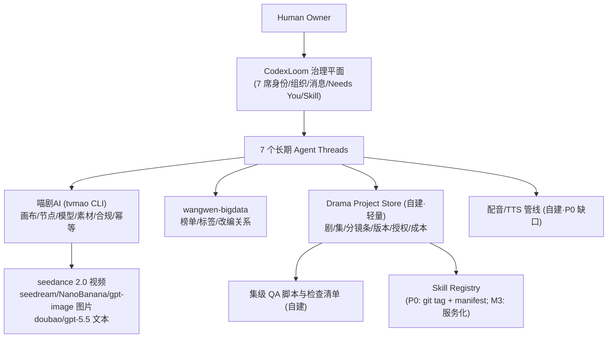

# AI 漫剧·短剧公司数字 Agent 团队可行性方案 V2

> 本文是对 V1 报告《AI 电影公司数字 Agent 团队可行性方案》的**评估、逻辑反驳与重新落地**。
> V1 是一份"媒介未定、后端未定、组织按最终形态设计"的通用蓝图；本文把已确认的真实业务锚点代入后，
> 给出实际的详细可行性方案。V1 的功能与优点**不删除**——凡是本文判定"现在不需要"的内容，
> 均标注启用条件而不是抹掉。

## 0. 文档定位

### 0.1 与 V1 的关系

| 维度 | V1 | 本文 (V2) |
|---|---|---|
| 产品形态 | 未定（60 秒样片到 90 分钟长片全谱系） | **多集竖屏短剧 + 多集横屏短剧，漫剧（动画风）先行** |
| 媒介 | 未定，只做敏感性分析 | 漫剧先行；升级路径：AI 真人短剧 → 微电影 |
| IP 来源 | 假设 Owner 已合法持有剧本 | **网文改编为主**，改编授权链是立项前置 |
| 生成后端 | 需从零新建 13 个配套组件 | **喵剧AI（tvmao CLI）已存在**，按 gap 补缺 |
| 市场数据 | 第二阶段再建 Market Data Store | **wangwen-bigdata 已存在**（番茄/红果/抖音榜单） |
| 组织 | 12 个长期 Agent | **6+1 席位，12 个责任域全保留** |
| 治理体系 | 完整设计 | **完整保留**，数字与题材适配短剧 |

### 0.2 已确认的业务锚点（Owner 决策，本文一切推导的基准线）

1. 第一目标：**多集竖屏短剧（9:16）与多集横屏短剧（16:9）**；
2. 媒介：**漫剧/动画风先行**，验证通过后升级 **AI 真人短剧**，再到**微电影**；
3. IP：**网文改编为主**（原创作为补充路径保留）；
4. 组织：**6 席左右**起步（本文建议 6 生产席 + 1 独立品控席，见第 3 节）；
5. 生产后端：**喵剧AI（tvmao CLI）**，不再自建 Provider 网关 / 编排器 / 媒资库 / 对象存储；
6. 治理：V1 的招聘评测、试用分级、Skill 进化、灰度回滚体系**完整保留**，按短剧规模适配；
7. 交付：单人 Owner，CodexLoom 作为 Agent 治理底座。

### 0.3 陈述标签（沿用 V1，这是 V1 应保留的优点之一）

- **当前能力**：已在 CodexLoom / 喵剧AI / wangwen-bigdata / 本地 skill 资产中核对的行为。
- **外部事实**：来自本文日期前可访问的官方文档、榜单或平台规则。
- **方案建议**：为本项目推导的设计，尚未实现或未经真实项目验证。
- **待验证假设**：必须通过样片、成本数据或市场实验确认的判断。

---

# 第一部分：对 V1 报告的评估与逻辑反驳

## 1. 总体评估结论

**V1 的治理设计是对的，业务锚定是错的。**

V1 最有价值的部分——陈述标签体系、镜头合同、版本锁与失效传播、职责分离（申请/批准/核销三权分立、QA 不归生产方裁决）、防奖励黑客、防提示注入分层、Needs You 与 GateDecision 分离、不可变 SkillVersion 与有作用域的 Deployment——全部保留，本文第二部分直接继承。

V1 的根本问题不是"写多了"，而是**在关键业务变量上拒绝决策，然后为所有可能性同时设计**。媒介未定 → 成本悬空；后端假设从零自建 → 组件清单膨胀；组织按 90 分钟长片的最终形态设计 → 12 席第一天到位；权利按好莱坞真人电影设防 → 工会协议和 C2PA 进了正文。这就是"过拟合"的来源：**不是功能多余，而是拟合对象错了**。

### 1.1 V1 必须保留的核心资产（明确不动）

| # | 资产 | V1 位置 | 本文继承方式 |
|---|---|---|---|
| 1 | 四类陈述标签 | §0.2 | §0.3 原样沿用 |
| 2 | 镜头合同（结构化生产工作单） | §4.5 | §5.4 改造为"分镜条合同"，对齐 15 秒段长 |
| 3 | 版本锁与失效传播 | §6.2 | §5.5 原样沿用 |
| 4 | 决策分级 D0–D3 / 能力更新分级 E0–E3 | §6.4 / §8.14 | §4.6 原样沿用 |
| 5 | 申请/批准/核销三权分立 | §3.1 / §6.4 | §4.6 原样沿用 |
| 6 | QA 独立、不归生产负责人裁决 | §3.2 | §3.2 保留独立品控席 |
| 7 | Capability Bundle（员工≠模型名） | §7.1 | §7.1 原样沿用 |
| 8 | 隐藏评测物理隔离 + 密封 Holdout | §7.4 | §7 保留，规模适配 |
| 9 | 不可变 SkillVersion + 有作用域 Deployment | §8.8 | §8 原样沿用 |
| 10 | 防奖励黑客（硬门禁+反指标） | §8.11 | §8.6 原样沿用 |
| 11 | 防提示注入 / 数据投毒分层 | §8.12 | §8.7 原样沿用 |
| 12 | 数据撤销与失效传播 | §8.13 | §8.8 原样沿用 |
| 13 | 中国 AIGC 标识合规矩阵 | §9.3 | §9.2 **升格为 P0**（这是 V1 写对但埋没的部分） |
| 14 | 返工因子 R 作为核心经济变量 | §12.1 | §10 原样沿用，代入实价 |
| 15 | 业务状态机与 Topic 生命周期分离 | §4.3 / §5.2 | §5.3 原样沿用 |
| 16 | "生成 Provider 回调先验签、幂等去重、再通知 Agent" | §5.8 | tvmao 已内置幂等键，原则沿用 |

**现实证据支持 #2/#14/#16**：tvmao 自身的 CLI 帮助文档写明"生产里 52% 的历史生成节点没保存模型，那些结果已经无法追溯用了哪个模型"。V1 关于"没有追踪的生成不算生产"的主张，已被你自己平台的真实生产数据验证——这不是过度设计，是已经付过学费的教训。

### 1.2 逻辑反驳（R1–R10）

以下每条按"V1 主张 → 反驳 → 对 V2 的影响"展开。

#### R1. 媒介留白导致全文自我悬空（决策依赖倒置）

**V1 主张**（§2.5）："影片媒介、时长、质量和预算尚未最终选定，因此成本与周期只能做敏感性分析。"
**反驳**：V1 自己在 §15 要求 Owner 在开始工程前必须决定"第一种产品形态、第一目标媒介"，却在报告主体拒绝代入任何一种，导致成本模型（§12）、风险差异（§10.3）、样片策略（§13.3）全部悬空为区间和假设。一份可行性报告的职责恰恰是**逼出这个决策再做推导**，而不是把最重要的自变量留白后宣布"经济性未知"。
**影响**：媒介已定（漫剧 → 真人 → 微电影）。V2 的成本模型（§10）用实价实算，风险表（§12）按漫剧口径重写。

#### R2. 采购分析对象与实际生产栈脱节

**V1 主张**（§1.1、§10.1、§12.2）：以 OpenAI Sora 2 与 Google Veo 3.1 为核心构建采购矩阵与 $0.03–0.70/秒 的价格敏感性。
**反驳**：V1 自己承认 Sora 2 已进入退役流程（2026-09-24 关闭）"只能作为结构证据"，却仍让它占据采购矩阵半壁；而真实生产栈——喵剧AI 上的 doubao-seedance 2.0 全家桶（mini/fast/pro，480p–1080p，9:16 与 16:9 原生，**15 秒段长，按条计价 0.2–5.98 元/15s**）——完全不在分析里。更关键的结构性差异：V1 基于"4–12 秒短片段"推导镜头拆分策略，而 seedance 的 15 秒段长与竖屏短剧"一条一个戏剧节拍"的节奏**天然对齐**，这改变了分镜的基本单位（见 §5.4）。
**保留其正确部分**：V1 的"短片段边界 → 镜头级生产再组装"的架构判断是对的，且"Provider 可替换抽象"原则依然成立——只是这层抽象**已经由喵剧AI 实现**，不需要再建。
**影响**：V2 删除 Sora/Veo 采购矩阵（转入 C 层：出海或真人升级需重新选型时启用其方法论），成本模型改用喵剧AI 实价（§10）。

#### R3. "必须新增 13 个配套组件"的前提已不成立

**V1 主张**（§5.4）：Film Project Store、Job Orchestrator、Provider Adapter、Media Asset Registry、Object Storage、Automated QC、Cost Ledger 等 13 项配套能力"首期必须新建"。
**反驳**：该清单的前提是"从零自建"。现实盘点（**当前能力**）：

| V1 要求的组件 | 现状 |
|---|---|
| Provider Adapter Layer | **喵剧AI 已覆盖**：统一模型接口、model list 带 inputSchema |
| Job Orchestrator（幂等/重试/回调） | **喵剧AI 已覆盖**：node run / run 查询与等待、内置 `--idempotency-key`、创建与运行分离 |
| Media Asset Registry + Object Storage | **喵剧AI 已覆盖**：asset upload/download、画布节点即资产图 |
| 内容合规预检 | **喵剧AI 已覆盖**：`tvmao compliance verify/status`（seedance 生成强制要求输入素材先过审） |
| Market Data Store（采集侧） | **wangwen-bigdata 已覆盖**：番茄小说榜单、红果短剧/漫剧榜单、抖音漫剧日/周/月榜、抖音漫剧快照、标签与 AI 内容分析、小说改编短剧关系 |
| Agent 治理平面 | **CodexLoom 已覆盖**（V1 §5.2 能力矩阵依然有效） |
| 编剧专业能力 | **已有资产**：screenwriting-master skill（四格式路由、八步工作流、连续性管理、记忆检查点）+ 已沉淀的网文改编 SOP（原著爽点坐标体检、重组/显化/杜撰三档改编边界、origin_gate、duration_gate 口型时长判据、返修分类逻辑） |

**真实缺口**（P0 要建的，见 §6.3）：剧集项目库（轻量）、集级 QA 检查清单与脚本、成本台账聚合、Skill Registry 的 git 起步实现、**配音/TTS 管线**（喵剧AI 画布节点只有 image/audio/video-input 与 image/video-generator 五种，没有音频生成节点——这是被 V1 的通用清单掩盖的、真正的第一缺口）。
**影响**：V2 §6 用"已有资产盘点 + 真实 gap"替代 V1 §5.4 的从零清单。

#### R4. 12 席组织违反了 V1 自己的扩编原则

**V1 主张**（§3）：第一天设 12 个长期 Agent，按好莱坞剧组部门聚合（表演导演、后期总监、声音音乐总监各占一席）。
**反驳**：V1 §3.3 自己写明扩编原则——"只有真实数据持续显示某个部门排队、上下文冲突或专业判断需要独立负责人时，才复制该专业 Agent"。这个原则是对的，但 V1 没有把它应用到自己的初始编制上：在没有任何生产数据时就断言漫剧流水线需要独立的表演导演席、声音音乐席和后期席。对动画风竖屏短剧，表演标注是分镜工作的一部分，声音是集级后期的一道工序，工作量撑不满长期岗位。
**保留其正确部分**：12 个**责任域的定义、交付物、绩效指标**（V1 §3.1 表格）全部有效——错的不是责任域划分，是"一个责任域 = 一个长期员工"的映射。
**影响**：V2 §3 采用 **6 生产席 + 1 独立品控席**，12 个责任域全部映射到席位（附映射表），席位分裂条件就用 V1 §3.3 的原则。

#### R5. 权利部分的重心与真实风险错位

**V1 主张**（§9）：以 WIPO 独立电影权利清理、美国版权局报告、WGA/DGA/SAG-AFTRA 工会协议、C2PA 2.4、ACES/IMF/BS.1770 母版标准为主体。
**反驳**：对"网文改编 + 漫剧 + 中国短剧平台发行"的真实业务，风险排序完全不同。真实的权利风险前三名：**①改编授权链**（网文版权方授权范围是否明确覆盖"漫剧/动画改编 + 信息网络传播 + 目标平台/地区/期限"，短剧行业大量纠纷源于授权范围含糊）；**②平台 AI 内容标识**（抖音/红果的 AIGC 标识与申报义务——V1 §9.3 其实写对了这部分，却被埋在工会协议和 C2PA 中间）；**③配音与声音权利**（若使用声音克隆需本人授权）。工会协议只在"雇佣受协议覆盖的真人人员"时适用，C2PA/ACES/IMF 只在专业长片交付链适用——它们不是错的，是**条件未触发**。
**影响**：V2 §9 以改编授权链 + AIGC 标识 + 配音权利为 P0 主体；工会/C2PA/母版标准移入 C 层（升级真人短剧、微电影或出海时按条件启用，内容不删）。

#### R6. 市场归因的统计刻度用错了单位

**V1 主张**（§8.10、§10.2）："电影数量少且题材差异大时，不应声称几部长片足以证明统计因果关系"，因此市场归因可行性"中低"，A/B 只适合海报标题。指标参照系用的是 YouTube。
**反驳**：这个统计判断对"年产几部的长片"成立，但对短剧**恰好反转**：一部竖屏短剧 60–100 集，每集是一个观测单位（完播、追更、卡点流失）；投流素材（切片/封面/标题）每天可产生几十个实验单元；同一题材可以多剧并行。**样本量问题在短剧赛道天然缓解**——V1 用长片的样本约束否定了短剧的实验空间。另外，目标平台是抖音/红果，YouTube 的指标联合解释框架方向正确但口径完全不适用（短剧的核心是完播率、追更率、单集流失点、投流 ROI、充值/会员转化）。
**保留其正确部分**："没有随机化不下因果结论""SRM 检查""一个实验族一个主终点""多重比较校正"这些方法论原样保留——它们在短剧的高频实验里**反而第一次真正用得上**。
**影响**：V2 §8.4 建立三层市场闭环：选题层（榜单→假设，只作相关信号）、剧集层（集为单位的留存诊断与准实验）、宣发层（投流素材真随机 A/B，可下因果）。

#### R7. 实施时序为最终形态服务，倒置了单人公司的生存逻辑

**V1 主张**（§13.1）：M0 基线 → M1 数据主干 → M2 编排 → M3 QA Gate → M4 SkillOps → M5 市场闭环 → M6 规模化，累计 20–33 周基建后才进入市场学习。
**反驳**：这是平台团队的建设顺序，不是单人公司的生存顺序。对单人 Owner，最大的风险不是"治理缺失"，而是**在验证商业模型之前把资源花在治理基建上**。V1 自己的分级门禁思想（先样片再短片再长片）是对的，但它把"每一级都要先建全套制度"作为默认。喵剧AI 与 wangwen-bigdata 的存在使得"先跑通一部剧、用手工治理攒下真实基线，再把治理自动化"成为可能——而 V1 的治理体系恰恰需要真实基线来校准它的全部阈值（V1 §7.6、§8.10 通篇写着"待真实基线校准"）。**先有基线，后有制度化，这正是 V1 阈值哲学的正确执行顺序。**
**影响**：V2 §11 重排路线图：M0 首集样片（手工治理）→ M1 前三集 + 圣经稳定性 → M2 整部竖屏剧上线 + 投流 A/B → M3 治理制度化（此时才建 Registry/Eval 服务）→ M4 横屏与多剧并发 → M5 真人短剧 Spike → M6 微电影。

#### R8. "商业经济性：未知"是自设留白的产物，不是真不可知

**V1 主张**（§10.2）：商业经济性"未知——必须以每合格秒成本、返工因子和市场结果实测"。
**反驳**：实测当然必要，但 V1 在写作时就已经可以给出漫剧口径的**先验区间**——它没给，是因为 R1 的媒介留白。代入喵剧AI 实价（外部事实，2026-08-02 CLI model list）：竖屏漫剧一集 90 秒 ≈ 6 条 15 秒；用 sd-2.0-mini 480p（1.95 元/15s）在返工因子 R=5 下单集视频生成成本 ≈ **58.5 元**，80 集整剧 ≈ **4,680 元**；即使用 pro 720p（5.55 元/15s）R=5 也只有 **166.5 元/集、1.3 万元/剧**。视频生成在漫剧成本结构里**不是主要矛盾**——图片圣经、配音、人工决策时间和投流预算才是。V1 的 $486–$56,700 长片敏感性表对本业务没有指导意义。
**影响**：V2 §10 给出完整的分项实算与 Go/No-Go 门槛。

#### R9. 第一验证目标的形态错位

**V1 主张**（§1.2、§13.3）：第一验证目标是"60–90 秒代表性样片"，第二级是"5–10 分钟完整短片"。
**反驳**：这个阶梯是为长片设计的降险路径。对多集短剧，天然的最小可验证单元就是**第一集**（竖屏 60–120 秒），它同时就是 V1 意义上的"代表性样片"——覆盖主角近景、对白、动作、情绪与场景，且直接可发布测试市场反应。第二级不是"5–10 分钟短片"，而是**前三集连续性验证**（跨集角色一致性、钩子结构、追更转化），第三级是整部剧。V1 的分级门禁思想保留，阶梯内容替换。
**影响**：V2 §11 的 M0/M1/M2 即此阶梯；V1 §13.3 的样片设计要求（覆盖困难点、完整声画字幕、全程追踪）原样继承到首集样片。

#### R10. V1 假设编剧能力从零招聘，忽略了已沉淀的核心资产

**V1 主张**（§7）：所有岗位从录用卡与题库考试开始，从零建立能力包。
**反驳**：编剧岗的核心能力已经存在并经过迭代：screenwriting-master skill（全格式工作流、连续性管理、记忆检查点、写作红线自检）与网文改编 SOP（原著爽点坐标体检输出"可改/需重组/不可改"三态、"重组/显化/杜撰"三档改编边界且杜撰恒为零预算、origin_gate 溯源门、duration_gate 3 字/秒口型时长判据、按叙事功能分类的返修逻辑、熔断计数）。这些资产恰好实现了 V1 自己要求的"Skill 分层 + 检查表 + 确定性脚本"。招聘评测体系对编剧岗的正确用法是**把现有 SOP 作为在任 Champion 建立基线**，而不是从零试镜。
**影响**：V2 §7.2 编剧岗录用卡直接挂载现有资产为 Champion Bundle v1。

### 1.3 V1 全文边界分层表

三层定义：**A = 现在必需**（第一部剧就要）；**B = 条件触发·规模化**（多剧并发 / 治理制度化里程碑 M3 后启用）；**C = 条件触发·形态升级**（真人短剧 / 微电影 / 出海 / 长片时启用）。**没有"删除"层**——所有 C 层内容在 V1 中原文保留，触发时回读。

| V1 章节 | 判定 | 说明 |
|---|---|---|
| §0 报告定位 / 陈述标签 | A | 原样继承 |
| §1 执行摘要 | 已被 V2 替代 | 结论"有条件可行"维持，条件内容更新 |
| §2 需求边界 | A（更新） | 锚点代入，见 V2 §2 |
| §3 12 Agent 组织 | A（重构） | 责任域保留，席位 6+1，见 R4 |
| §4 端到端流程 | A（改造） | 镜头合同→分镜条合同；阶段表按短剧重写 |
| §5 CodexLoom 适配性 | A | §5.2 能力矩阵、§5.7 硬隔离、§5.8 单 Turn 限制全部有效且继承 |
| §5.4 13 组件清单 | A（重构） | 改为 gap 分析，见 R3 |
| §6 协调与自治规则 | A | 工作单、版本锁、缺陷路由、D0–D3 原样继承 |
| §7 招聘评测试用 | A（适配） | 完整保留，数字与题材适配，见 V2 §7 |
| §8 Skill 进化 | A（适配） | 完整保留；市场闭环单位改为集/素材，见 R6 |
| §9.1 权利清理 | A（重心调整） | 改编授权链升为主体，见 R5 |
| §9.2 作者资格 / 工会 | C | 雇佣受协议覆盖真人人员时触发 |
| §9.3 中国 AIGC 标识 | **A（升格）** | 抖音/红果发行的 P0 义务 |
| §9.4 C2PA 溯源 | B/C | 内部 RunManifest 是 A；C2PA 签名在平台或商务要求时触发 |
| §9.5 安全边界 | A | 原样继承 |
| §9.6 母版技术基线（ACES/IMF/BS.1770） | C | 微电影/院线/出海交付时触发；短剧按平台上传规格即可 |
| §10 技术可行性 | A（更新） | 采购矩阵换喵剧AI 实测；三大技术问题（短片段/组合连续性/物理正确性）判断保留 |
| §11 风险登记表 | A（更新） | 见 V2 §12 |
| §12 成本模型 | A（重算） | 见 R8、V2 §10 |
| §13 路线图 | A（重排） | 见 R7、V2 §11 |
| §14 指标体系 | A（换口径） | 平台指标换抖音/红果，其余保留 |
| §15 Owner 待决清单 | A（更新） | 多数已决，剩余见 V2 §13 |
| §16 P0/P1 范围 | A（重构） | 按 V2 路线图重排 |
| §17 API 边界 | B | M3 治理制度化时启用；P0 用文件与 CLI 约定 |
| §18 技术未知项 | A（更新） | 见 V2 §13.2 |
| §19 最终建议 | 已被 V2 替代 | — |
| 附录 A–E | A | 审计方法与独立审阅提示词继承，对象换为本文 |

---

# 第二部分：实际详细可行性方案

## 2. 业务目标与边界

### 2.1 业务目标

建立一家单人 Owner 的 AI 漫剧·短剧公司：

- 从榜单数据与网文库中选题，完成改编授权，将网文改编为多集短剧剧本；
- 以漫剧（动画风）为首发媒介，同一剧本按 9:16 竖屏与 16:9 横屏双画幅规划生产；
- 通过 6+1 席数字员工完成拆解、圣经、分镜、生成、后期、质检、上线与投流；
- 对每条生成素材保留模型、Skill、提示词、参考图、成本与质检来源（吸取 tvmao "52% 节点无模型记录"的教训）;
- 从榜单与投放数据中提出改进假设，经独立评测与灰度安全升级工作方法；
- 漫剧模式验证后，沿"AI 真人短剧 → 微电影"升级，升级时按 §1.3 的 C 层条件回读 V1 相应内容。

### 2.2 非目标（第一阶段明确不承诺）

- 一个 Prompt 生成整集或整剧；
- 未取得明确改编授权前投产任何网文改编项目；
- 90 分钟长片（微电影 ≤ 30 分钟是 M6 之后才评估的目标）；
- Agent 自行修改岗位边界、工具权限或正式 Skill（继承 V1）；
- 把播放量 / 投流 ROI 作为唯一优化目标（继承 V1 防奖励黑客）；
- 把 CodexLoom 改造成项目 DAG、媒资库或 Skill Registry（继承 V1 §5.2 边界）。

### 2.3 Owner 核心操作闭环

1. 批准选题与改编授权方案（含预算上限）；
2. 批准首集样片（等价 V1 的代表性样片 Gate）；
3. 处理预算突破、权利例外、重大创意例外；
4. 批准整剧上线与投流预算。

其余工作由制片统筹席组织，Owner 不直接管理全部席位（继承 V1 §2.3）。

### 2.4 成功定义

- **技术成功**：按平台规格交付完整可播、全程可追溯、过 QA 的剧集包；
- **运营成功**：周更 ≥ N 集（N 由 M1 实测定），Owner 介入率与返工可观测；
- **经济成功**：每合格分钟综合成本、单集周期、返工因子落在 Owner 预设上限内；
- **市场成功**：完播率、追更率、投流 ROI 达到平台同类基准，且无版权/品牌/投诉事故；
- **学习成功**：候选 Skill 改进由独立评测证明并可回滚（继承 V1）。

## 3. 组织：6+1 席位 × 12 责任域

### 3.1 席位表

V1 §3.1 的 12 个责任域（含交付物与绩效指标定义）**全部有效**，映射如下：

| 席位 | Agent ID | 承接的 V1 责任域 | 核心职责与工具 |
|---|---|---|---|
| 1. 制片统筹 | `studio-producer` | #1 执行总制片 + #2 单片制片 | 立项政策、阶段推进、预算、Owner 唯一入口、决策包；单剧在制时两域合一，多剧并发时分裂出单剧制片（V1 §3.3 原则） |
| 2. 选题与研究 | `topic-research` | #3 开发研究（含 rights-research 受限 Skill） | wangwen-bigdata 榜单分析、题材趋势、原著爽点坐标体检（三态输出）、改编授权证据收集与缺项标记（法律结论仍归外部专业人员） |
| 3. 编剧 | `story-writer` | #4 编剧 | 网文改编 SOP（重组/显化/杜撰三档、origin_gate、duration_gate）+ screenwriting-master skill；分集大纲、集内节拍、锁定剧本、连续性状态表 |
| 4. 视觉导演 | `visual-director` | #5 视觉美术 + #6 导演 + #7 表演导演 | 角色/场景圣经、参考图资产库、分镜条表（含表演与情绪标注）、双画幅构图规划、可生成性审查 |
| 5. 生成与后期 | `production-supervisor` | #8 生成总监 + #9 后期 + #10 声音音乐 | 驱动 tvmao（画布组织、合规预检、批量生成、候选管理）、配音/BGM 管线、剪辑合成、平台规格交付 |
| 6. 发行运营 | `distribution-ops` | #12 营销发行 | 平台上架、AIGC 标识申报、投流素材生产与 A/B、市场数据回流登记 |
| 7. 品质合规（独立） | `quality-governance` | #11 品质与合规 | 集级 QA、连续性审计、权利与标识检查、隐藏评测裁决；**不归制片统筹裁决，直通 Owner**（继承 V1 §3.2） |

Production Accounting 沿用 V1 的系统级职责分离：成本台账自动记账（§6.3），申请/批准/核销不集中于任何一席。

### 3.2 为什么品控必须独立成席

V1 "生产负责人不能给自己验收"的原则被完整治理决策保留。在 6 席方案中把 QA 折进发行或统筹席会破坏这条原则——发行席有上线压力，统筹席有进度压力。第 7 席是治理原则的最低实现，也是"6 个左右"的合理上界。

### 3.3 组织关系（CodexLoom 内）

- Owner → 制片统筹：应用层 Gate 与 Needs You 关系（不是 Organization edge，继承 V1 §3.2 的当前能力边界）；
- Organization 树：`studio-producer` 为根，其余 6 席为直接下级；
- 品控席通过 Collaboration 与各生产席建立横向验收接口，验收结论直通 Owner；
- V1 §5.7 硬隔离要求全部有效：每席最小 sandbox 与工具白名单、不得默认 `danger-full-access`、tvmao 与平台凭证走受管代理、品控只读生产追踪。

### 3.4 席位分裂触发条件（V1 §3.3 原则的正确应用）

| 信号（连续 2 个复盘周期出现） | 动作 |
|---|---|
| 多剧并发且统筹席消息队列 age 持续超标 | 分裂单剧制片席 |
| 配音/音乐工作量或专业缺陷率持续独立聚集 | 从生成后期席分裂声音席（回到 V1 #10） |
| 表演/运动标注缺陷成为主要返工原因 | 从视觉导演席分裂表演席（回到 V1 #7） |
| Skill 迭代负载跨剧持续存在 | 增设能力教练席（V1 第 13 类角色） |

## 4. 端到端流程：从榜单到上线

### 4.1 流程总览

```text
榜单选题（wangwen-bigdata）
→ 原著爽点坐标体检（三态：可改 / 需重组 / 不可改）
→ 改编授权（范围必须覆盖：漫剧/动画改编 + 目标平台 + 地区 + 期限 + 后续真人改编选项）
→ 立项章程（Owner Gate 1）
→ 分集大纲与剧本锁定（网文改编 SOP：重组/显化合法，杜撰禁止）
→ 角色/场景圣经 + 分镜条表（双画幅规划）
→ 首集样片（Owner Gate 2）
→ 批量集生产（tvmao：合规预检 → 图 → 视频 → 配音合成）
→ 集级 QA 与定向返修
→ 上线与 AIGC 标识申报（Owner Gate 3：整剧与投流预算）
→ 投流素材 A/B + 市场数据回流
→ 复盘 → 候选 Skill →（M3 后）评测/灰度/晋升
```

### 4.2 剧集入口合同（改造 V1 §4.1）

```yaml
project_name:
novel_source:              # 原著、版权方、授权合同 ID
adaptation_rights_scope:   # 媒介（漫剧/真人预留）/平台/地区/期限/分成
series_format: vertical | horizontal | both
episode_count_target:
episode_duration_seconds:  # 竖屏典型 60–120s；横屏典型 120–180s
visual_style_bible_ref:
dialogue_change_policy:    # 三档改编边界引用
target_platforms:          # 红果 / 抖音 / 其他
audience_and_rating:
budget_ceiling_total:
budget_ceiling_per_episode:
weekly_release_cadence:
aigc_labeling_policy:      # 平台申报方式
```

### 4.3 阶段流水线（替换 V1 §4.2）

| 阶段 | Responsible | 锁定交付 | 门禁 | 人类参与 |
|---|---|---|---|---|
| 0 选题与体检 | 选题研究 | 选题包、爽点坐标表、三态结论 | "不可改"即止损 | 否 |
| 1 授权与立项 | 制片统筹 | 授权证据链、立项章程 | 授权范围覆盖检查；例外交外部法律 | **Owner 批准** |
| 2 剧本编译 | 编剧 | 分集大纲、锁定剧本、连续性状态表 | origin_gate 全过、duration_gate 达标 | 仅重大改编例外 |
| 3 圣经与分镜 | 视觉导演 | 角色/场景圣经、分镜条表（双画幅） | 版本一致、每条可生成性过审 | 否 |
| 4 首集样片 | 生成后期 | 完整第 1 集（声画字幕齐备） | QA 通过 + 成本实测入账 | **Owner 批准** |
| 5 批量生产 | 生成后期 | 合格集、追踪记录 | 每批 QA、预算熔断 | 仅例外 |
| 6 上线发行 | 发行运营 | 平台成片包、AIGC 标识、投流素材 | 标识与权利终检（品控） | **Owner 批准** |
| 7 数据回流与复盘 | 发行运营+选题研究 | 市场观察记录、复盘报告、候选假设 | 数据只产假设不改生产（继承 V1） | 否 |

业务状态机沿用 V1 §4.3 的设计方法（外部业务状态 + Topic 原生生命周期分离），状态名按上表阶段替换。

### 4.4 分镜条合同（改造 V1 §4.5 镜头合同）

漫剧的生产基本单位是**15 秒分镜条**（seedance 段长），一集 = 4–8 条。每条合同：

```yaml
strip_id: EP012_ST03
episode_id:
canvas_node_ids:           # tvmao 节点引用（模型必填——52% 教训）
purpose:                   # 本条承担的戏剧节拍（对应剧本节拍表）
duration_seconds: 15
ratio: 9:16 | 16:9
model: cm-seedance-2.0-*   # 显式模型 ID，禁止留空
input_versions:
  script:
  character_bible:
  scene_bible:
reference_assets:          # --left 顺序即输入顺序（tvmao 语义）
compliance_status:         # 输入素材合规校验必须 active 才可生成
dialogue_audio_ref:        # 口型对齐的配音轨（外部管线）
continuity_in / continuity_out:
forbidden_changes:
acceptance_criteria:
candidate_count:
retry_limit:
budget_limit_cny:
```

版本锁与失效传播规则原样继承 V1 §6.2；缺陷路由表继承 V1 §6.3，路径中的席位名替换为 §3.1 的 7 席。

### 4.5 双画幅生产策略（新增，V1 无对应内容）

**方案建议**：竖屏与横屏不是同一素材的裁切关系——构图、信息密度、节奏都不同。

- 剧本与配音轨共用；分镜条表分画幅各出一版（视觉导演席职责）；
- 生成按画幅分批（seedance 原生支持 9:16 与 16:9，同 prompt 不同 ratio 是两次生成、两份成本）；
- 先竖屏整剧上线验证，横屏版按竖屏市场数据决定是否投产（横屏成本 ≈ 竖屏 × 0.8–1.2，**待验证假设**）；
- 圣经与参考图资产双画幅通用（图片模型支持双向分辨率）。

### 4.6 决策分级

D0–D3 与 E0–E3 原样继承 V1 §6.4 / §8.14；D3 例新增"改编授权范围例外"。财务三权分立原样继承。

## 5. 系统架构：已有资产 + 真实缺口

### 5.1 架构图



### 5.2 tvmao 使用规范（当前能力 → 生产纪律）

- **一部剧一个 project**，目录绑定（`project use`），画布按"集"分区组织节点；
- 生成节点**必须显式 `--model`**（tvmao 不会代选；52% 无模型记录的历史教训写入岗位红线）；
- 参考图连线顺序即模型输入顺序（`--left` 语义），分镜条合同中 `reference_assets` 按序登记；
- seedance 生成前所有输入素材必须 `compliance verify` 且状态 `active`（平台强制，异步，纳入批量生产的前置批处理步骤）；
- 每条命令带外部幂等键（`--idempotency-key` = `strip_id + attempt_no`），失败重试不产生重复计费任务；
- `node run --wait` / `run` 查询纳入生成席 SOP；候选下载后立即登记哈希与成本入台账。

### 5.3 Drama Project Store（自建，轻量起步）

**方案建议**：P0 不建服务，用 git 仓库内结构化文件（YAML/JSONL）+ 校验脚本实现：

- `films/<剧>/project.yaml`（入口合同）、`episodes/<集>/strips/*.yaml`（分镜条合同）、`ledger.jsonl`（成本台账：每次生成的模型/时长/单价/结果）、`rights/`（授权证据链）、`qa/`（缺陷单与验收记录）；
- 稳定 ID 体系继承 V1 §5.5（`film_id / episode_id / strip_id / asset_version_id / qa_report_id …`）；
- M3 若多剧并发使文件方案出现并发冲突，再按 V1 §17 API 边界服务化——**这是 V1 §17 的正确启用时机，不是第一天**。

### 5.4 真实缺口清单（P0 必建）

| 缺口 | 说明 | 建议 |
|---|---|---|
| **配音/TTS 管线** | tvmao 画布无音频生成节点；漫剧对白必须配音且 duration_gate（3 字/秒）依赖配音时长 | 选型外部 TTS（火山语音等，走独立采购验证——arkcli 当前不覆盖 TTS 调用），封装为生成席受管工具；声音克隆需授权（§9.3） |
| 集级 QA 脚本 | 技术规格（时长/分辨率/响度/黑帧）、连续性抽查清单 | ffprobe 类确定性脚本 + 品控席人工清单 |
| 成本台账聚合 | tvmao 有计费但无剧集维度台账 | ledger.jsonl + 周报脚本，算 R 与每合格分钟成本 |
| Skill Registry 起步版 | V1 §8.8 的不可变版本原则 | git tag + `skill_set_manifest.yaml` 每剧冻结；M3 服务化 |
| wangwen-bigdata 配额续期 | **当前能力**：本文写作时查询配额已用尽 | 选题席开工前的运营前置项 |

### 5.5 继承的 CodexLoom 边界

V1 §5.2 能力矩阵、§5.6 大媒体处理（Artifact 只放 Manifest 与预览，媒体在喵剧AI/对象存储）、§5.7 硬隔离、§5.8 单 Turn 并发限制，全部原样有效。特别地：制片统筹席不得用永不结束的 Goal 充当排剧调度器；批量生成等待放在 tvmao 侧，Agent 只处理计划、例外与验收。

## 6. 工作单与协调规则

继承 V1 §6 全部内容（工作单 Schema、因果回复、版本锁、缺陷路由、重试上限、决策分级），仅两处适配：

1. 工作单 Schema 增加 `episode_id / strip_id / ratio` 字段；
2. 缺陷路由表的责任席位按 §3.1 映射（例如"动作、眼神、口型问题"路由：视觉导演 → 生成后期 → 品控）。

## 7. 招聘、评测与试用（完整治理，短剧适配）

V1 §7 的骨架**全部保留**：Capability Bundle 定义、岗位录用卡、多候选试镜（受控变量比较 vs 完整系统比较必须预注册）、题库六类任务配比、练习/验证/密封 Holdout 物理隔离、无状态 Eval Runner、四维评分组合（确定性/独立模型/专家盲评/真实结果）、Judge 版本化与校准、不可补偿硬门禁、四级试用 L0–L3、`role_probation_spec` 冻结。

### 7.1 短剧适配项

| V1 设定 | V2 适配 | 理由 |
|---|---|---|
| 每岗 50→100 题题库 | 每岗 **30 题起步**，随生产积累扩到 50+ | 6+1 席 × 单人出题成本；题目直接从真实生产工作单脱敏沉淀 |
| 题材：电影岗位任务 | 题材：漫剧短剧任务（榜单分析、爽点体检、15s 分镜、双画幅、合规预检、口型时长） | 评测有效性 |
| 试用观察期按"周/30 天" | 按**集数**计（L1 ≥ 3 集、L2 ≥ 10 集、L3 ≥ 一部整剧） | 短剧生产节奏快于日历窗口 |
| Judge 校准统计门槛（α ≥ 0.67/0.80 等） | **保留公式与"样本不足=不确定"原则**，首个基线在 M1–M2 用真实缺陷样本建立后才启用统计门禁；之前品控席全检代替 | 这正是 V1 自己"阈值必须由真实基线校准"的执行顺序（见 R7） |
| 首次招聘无 Champion → 淘汰赛 | 编剧岗例外：现有改编 SOP + screenwriting skill 直接作为 Champion Bundle v1（见 R10）；其余席位淘汰赛 | 已有经过迭代的资产 |

### 7.2 各席位录用卡要点（`role_hiring_spec` 摘要）

- **制片统筹**：硬门禁 = 漏升级 D3 事项 0 观察、预算越权 0；主指标 = 决策包盲评；
- **选题研究**：硬门禁 = 虚构来源 0、授权状态误报 0；主指标 = 三态体检结论与人工复核一致率；
- **编剧**：硬门禁 = origin_gate 违例（杜撰）0、设定违背 0；主指标 = 集节拍盲评 + duration_gate 一次通过率；
- **视觉导演**：硬门禁 = 角色身份漂移严重级 0；主指标 = 圣经一致性盲评、分镜可生成性一次通过率；
- **生成后期**：硬门禁 = 无模型记录的生成节点 0（52% 教训）、合规预检未过即生成 0；主指标 = 首轮通过率、每合格分钟成本；
- **发行运营**：硬门禁 = AIGC 标识漏报 0、未授权素材上线 0；主指标 = 交付一次通过率、投流实验规范执行率；
- **品控**：硬门禁 = 严重缺陷漏检 0 观察（报告 N 与置信上界，继承 V1 统计表述纪律）；主指标 = 召回/误报。

## 8. Skill 进化与市场学习闭环（完整治理，三层市场结构）

### 8.1 学习章程

V1 §8.1 的 Owner 学习章程原样保留，`allowed_data_sources` 填实：wangwen-bigdata（榜单/标签/改编关系）、目标平台后台数据、投流平台数据。

### 8.2 三种学习的分层

V1 §8.2（知识更新 / Skill 进化 / 微调）原样保留；首期只用前两种。

### 8.3 数据分层与防护

V1 §8.3（raw→curated→development→hidden-eval→live-canary）、§8.12 防注入防投毒工程控制、§8.13 数据撤销失效传播，**原样继承**。特别地：`title_group_id` 防泄漏规则对短剧尤其重要——同一部剧的集不得跨开发集与隐藏评测集拆分。

### 8.4 三层市场闭环（R6 的落地，替换 V1 §8.4 的单层结构）

| 层 | 观测单位 | 频率 | 因果强度 | 用途 |
|---|---|---|---|---|
| 选题层 | 题材 × 平台 × 时间窗（榜单） | 日/周 | **仅相关信号** | 产生选题假设；禁止直接下"某题材导致爆款"结论 |
| 剧集层 | 集（完播、流失点、追更） | 每集上线后 | 准实验（同剧集间对照、上线时间混杂需登记） | 节拍/钩子诊断 → 编剧与分镜候选假设 |
| 宣发层 | 投流素材（切片/封面/标题） | 每日多单元 | **可真随机 A/B** | SRM、预注册主终点、多重比较校正——V1 §8.4 的完整实验 Schema 在这层原样启用 |

`market_observation` 与 `production_trace` Schema 继承 V1 §8.4，平台指标字段按抖音/红果口径映射（完播率、追更率、单集流失点、投流 ROI、充值/会员转化）；YouTube 参照系仅在出海时启用（C 层）。

### 8.5 进化闭环与职责分离

V1 §8.5 流程图、§8.6 职责分离表、§8.7 Skill 分层（稳定核心/岗位 SOP/类型 Playbook/市场 Overlay + 渐进披露）、§8.8 不可变 SkillVersion + Deployment、§8.9 影片能力冻结清单（改名"剧集能力冻结清单"）、§8.10 晋升回滚门槛结构、§8.11 防奖励黑客——**全部原样继承**。

适配两点：

1. §8.10 的岗位基线表换成 §7.2 的七席；所有数字维持"起始建议，待真实基线校准"的 V1 纪律；
2. P0 阶段（M0–M2）Skill 变更走"Owner 人工批准 + git tag + 每剧 manifest 冻结"的手动流程；M3 起启用 Shadow/Canary/Promotion 自动化。**这不是砍掉灰度体系，是让它在有真实基线后上岗**（R7）。

## 9. 权利与合规（短剧口径）

### 9.1 改编授权链（P0 核心，新增详细设计）

每个网文改编项目立项前必须冻结 `AdaptationRightsRecord`：

```yaml
adaptation_rights_record:
  novel_id:                  # 关联 wangwen 数据的作品 ID
  rights_holder:             # 版权方（平台/作者/中间方）
  contract_id:
  granted_media:             # 必须显式包含：漫剧/动画改编；真人改编是否含（升级路径预埋）
  granted_rights:            # 改编权 + 信息网络传播权（缺一不可）
  platforms:                 # 红果/抖音/…
  territory:
  term:
  exclusivity:
  revenue_share:
  derivative_rights:         # 续作/衍生/投流素材二创
  credit_requirements:
  approval_requirements:     # 版权方对剧本/成片的审看权
  evidence_files:
```

选题研究席只做证据收集与缺项标记；授权有效性结论由外部专业人员出（继承 V1 rights-research 边界）。**授权范围未显式覆盖"动画/漫剧改编"的合同不得开机**——这是短剧行业真实纠纷高发点（方案建议，个案以法律意见为准）。

### 9.2 AIGC 标识与平台申报（V1 §9.3 升格为 P0）

- 《人工智能生成合成内容标识办法》与 GB 45438—2025 自 2025-09-01 施行（外部事实，继承 V1 核对）；
- 发行运营席的上线 SOP 必含：平台 AIGC 声明勾选、显式标识策略、成片元数据、申报记录归档；
- 品控席上线终检项：标识完整性 + 授权链完整性双查；
- V1 §9.3 的"主体 × 行为"适用矩阵原样保留——公司同时是内容生产方与平台发布方，按矩阵对号入座。

### 9.3 配音与声音权利

- TTS 商用授权条款随采购验证（§5.4）；
- 声音克隆必须有被克隆人书面授权，否则只用平台商用音色库；
- 音乐/BGM 只用已授权曲库，`ledger` 登记每集用曲。

### 9.4 条件触发层（C 层，内容在 V1 保留不删）

| 触发条件 | 回读 V1 |
|---|---|
| 升级 AI 真人短剧（真人肖像/表演/声音介入） | §9.1 肖像声音授权、§9.2 数字替身与工会适用判断 |
| 出海发行 | §9.3 末段"地区规则另行加载"、YouTube/TikTok 指标 |
| 微电影/院线级交付 | §9.4 C2PA、§9.6 ACES/IMF/BS.1770 |

### 9.5 安全边界

V1 §9.5 原样继承（凭证管理、不可信输入、最小权限、Kill Switch、预算熔断）。

## 10. 成本模型（实价实算）

### 10.1 单价基线（外部事实：喵剧AI model list，2026-08-02 快照，采购前需复核）

| 用途 | 模型（示例） | 单价 |
|---|---|---:|
| 视频·经济档 | yd2.0-mini（15s 固定） | 0.2 元/15s |
| 视频·量产档 | cm-seedance-2.0-mini-mg 480p/720p | 1.95 / 3.0 元/15s |
| 视频·质量档 | cm-seedance-2.0-pro-mg 480p/720p | 4.05 / 5.55 元/15s |
| 视频·多参考图档 | cm-seedance-2.0-*-mg-gz（9 图） | 2.45–5.98 元/15s |
| 图片圣经/分镜参考 | seedream 5.0 / Nano-Banana / gpt-image-2 | 按平台积分计 |

### 10.2 单集与整剧实算（竖屏漫剧，90 秒/集 ≈ 6 条 15s）

计算口径：`成本 = 条数 × 单价 × R`（R = 计费条数/合格条数，继承 V1 §12.1）。

| 档位 | R=3 | R=5 | R=8 |
|---|---:|---:|---:|
| mini 480p（1.95 元） | 35 元/集 | 59 元/集 | 94 元/集 |
| mini 720p（3.0 元） | 54 元/集 | 90 元/集 | 144 元/集 |
| pro 720p（5.55 元） | 100 元/集 | 167 元/集 | 266 元/集 |
| **80 集整剧（mini 720p）** | **4,320 元** | **7,200 元** | **11,520 元** |
| **80 集整剧（pro 720p）** | **7,992 元** | **13,320 元** | **21,312 元** |

**结论（对 R8 的落地）**：漫剧的视频生成成本在**千元到两万元级**，不构成商业可行性的主要矛盾。真正的成本大头与不确定项：

```text
C_total = 视频生成（上表）
        + 图片圣经与参考图（角色×表情×服装×场景，估数百到上千次生成——待验证假设）
        + 配音（TTS 按字计费或包月——采购前未知）
        + 改编授权（一次性或分成——商务变量，可能远超生成成本）
        + 投流预算（决定市场验证质量——Owner 预算决策）
        + Owner 与外部专业人员时间
```

横屏版另计（×0.8–1.2 系数，待验证）。

### 10.3 必须持续追踪的经济指标

继承 V1 §12.3 全部指标，单位从"秒"换算为"条/集/分钟"；新增：`cost_per_episode`、`strip_first_pass_rate`（分镜条首轮通过率）、`voice_cost_per_episode`、`promotion_roi`。

### 10.4 Go/No-Go 门槛（Owner 立项前给出）

继承 V1 §12.4 结构：每合格集最高成本、最大 R、单集最大周期、最低完播基准、投流亏损止损线、不可牺牲的创作与品牌条件。

## 11. 实施路线图（时序重排，R7 的落地）

| 里程碑 | 内容 | 退出条件 | 治理形态 |
|---|---|---|---|
| **M0 首集样片** | 选一部已授权或免授权验证题材，手工治理跑通完整第 1 集（剧本→圣经→分镜→生成→配音→成片） | 声画字幕完整可播；100% 分镜条有模型/成本/版本记录；实测 R 与单集成本入账 | 手动：Owner 直接验收 |
| **M1 前三集** | 跨集角色一致性、钩子结构、周更节奏演练；QA 清单成形 | 三集连续性抽查通过；单集周期 ≤ 目标；缺陷分类台账建立 | 品控席上岗全检 |
| **M2 整剧上线** | 全集生产、平台上架、AIGC 标识、投流素材 A/B 第一轮 | 整剧交付；完播/追更/ROI 数据回流；R 与成本落在门槛内 | 手动 Skill 变更 + git tag 冻结 |
| **M3 治理制度化** | 用 M0–M2 真实基线校准阈值；Eval Runner、Skill Registry 服务化、Shadow/Canary 启用；V1 §17 API 按需实现 | 一次完整的 Challenger→评测→灰度→晋升/回滚演练 | V1 完整治理全量上岗 |
| **M4 横屏与多剧并发** | 横屏版投产决策（按 M2 数据）；第二部剧并行；席位分裂评估（§3.4） | 双剧并发不互相污染版本/预算/资产 | 完整治理 |
| **M5 真人短剧 Spike** | 真人感媒介技术验证（一致性/口型/表演），回读 V1 C 层权利内容 | 真人首集样片通过 + 权利链就绪 | 完整治理 |
| **M6 微电影评估** | 按 V1 长片级要素（Subplot/世界观分层/序列制）评估，回读 V1 §9.6 母版标准 | Owner 单独立项决策 | 完整治理 |

**关键排序逻辑**：治理阈值的校准数据来自 M0–M2 的真实生产；制度化（M3）放在验证（M2）之后，正是 V1 "所有阈值待真实基线校准"哲学的正确执行顺序。

## 12. 风险登记表（更新）

继承 V1 §11 中依然适用的条目（角色漂移、成本失控、模型退役、提示注入、奖励黑客、隐藏题泄漏、Skill 破坏在制项目、Owner 瓶颈等），调整与新增：

| 风险 | 概率 | 影响 | 主要控制 | 状态 |
|---|---|---|---|---|
| 改编授权范围不含漫剧/平台/地区 | 中 | 严重 | §9.1 授权记录冻结 + 外部法律意见 + 未覆盖不开机 | **新增，P0** |
| 平台 AIGC 内容政策收紧或流量降权 | 中 | 高 | 标识合规 + 多平台分发 + 政策监测入选题席周报 | 新增 |
| 喵剧AI 单点依赖（自有平台故障/模型下架） | 低-中 | 高 | 自有平台可控是优势；但 seedance 上游（火山）退役/变价风险保留 V1 Provider 迁移预案思想 | 调整 |
| 配音管线缺口拖延 M0 | 中 | 中 | §5.4 P0 采购验证前置 | 新增 |
| 题材同质化/榜单跟风导致内容贬值 | 中 | 中 | 选题层只产假设 + Owner 创作原则硬门禁（继承防奖励黑客） | 新增 |
| wangwen-bigdata 配额/口径变化 | 已发生（配额尽） | 中 | 续期纳入运营 SOP；关键结论落地前二次核验 | **当前事实** |
| 双画幅成本失控 | 中 | 中 | 横屏投产以竖屏数据为门禁（§4.5） | 新增 |
| V1 遗留：52% 无追踪教训重演 | 低（已设硬门禁） | 高 | 生成席硬门禁 + 品控终检 | 已控 |

## 13. Owner 待决清单与技术未知项

### 13.1 仍需 Owner 决定（V1 §15 中尚未被本轮决策覆盖的）

1. 第一部剧的具体选题与授权预算上限；
2. 周更节奏目标（决定产能与席位负载假设）；
3. 投流预算区间与止损线；
4. TTS/配音供应商选型确认（含声音克隆政策）；
5. 每合格集成本上限与最大 R（Go/No-Go 门槛数值）；
6. 品牌边界与不可牺牲的创作原则（防奖励黑客的目标函数输入）。

### 13.2 优先验证的技术未知项（更新 V1 §18）

1. seedance 2.0 在动画风格下的角色一致性实测（多参考图 gz 档 vs 普通档的差异）；
2. 15 秒条内的口型/对白对齐质量与 duration_gate 判据的匹配度；
3. 图片圣经的最优参考图数量与生成成本实测；
4. tvmao 合规校验的平均延迟对批量生产吞吐的影响；
5. 双画幅同 prompt 生成的构图质量差异（决定横屏是重新分镜还是参数化复用）；
6. 抖音/红果对 AI 漫剧的实际流量政策与标识执行口径；
7. 单集从锁定剧本到成片的真实周期（决定周更可行性）。

## 14. 最终可行性表述

> 在 2026 年的技术与资产条件下——CodexLoom 治理 6+1 席长期数字员工、喵剧AI 承担生成与媒资、wangwen-bigdata 提供选题信号、已沉淀的网文改编 SOP 作为编剧席 Champion——以漫剧为首发媒介的多集竖屏/横屏短剧公司**可行性为中高**，显著高于 V1 对通用"AI 电影公司"的"有条件可行"判断，因为 V1 所列的多数前置条件（生产后端、市场数据、编剧能力、媒介决策）已经满足。
>
> 视频生成成本（千元到两万元级/剧）不是主要矛盾；**改编授权、配音管线、平台标识合规与投流经济性**才是第一部剧的关键验证项。V1 的完整治理体系全部保留，在 M0–M2 用真实生产基线完成校准后于 M3 全量上岗；升级 AI 真人短剧与微电影时，按边界分层表回读 V1 相应内容。
>
> 不能承诺的事项与 V1 一致：一个 Prompt 生成整剧、无人参与的公开发行、以及在授权链不完整时投产任何改编项目。

---

## 附录 A：本文审计范围与局限

- 对喵剧AI 的判断来自 2026-08-02 本机 tvmao CLI（`--help`、`model list`）的输出，未做真实生成压测；价格为当日快照；
- 对 wangwen-bigdata 的判断来自其 MCP 服务声明，本文写作时查询配额已用尽，表结构未逐一核验；
- 对 CodexLoom 的判断沿用 V1 附录 A 的静态审计结论与局限；
- 对网文改编 SOP 的引用来自本地已沉淀的工作记录（原著体检三态、三档改编、origin_gate、duration_gate），其文件级现状在 M0 开工前应复核；
- 所有法律相关表述均为风险设计清单，不构成法律意见（继承 V1 §9 声明）。

## 附录 B：V1 → V2 快速对照

| 问题 | V1 答案 | V2 答案 |
|---|---|---|
| 做什么 | 未定媒介的"AI 电影" | 漫剧竖屏+横屏短剧 → 真人短剧 → 微电影 |
| 剧本从哪来 | 假设 Owner 已持有 | 网文改编（授权链 P0） |
| 几个员工 | 12 + 2 控制职能 | 6 生产席 + 1 品控席，12 责任域全保留 |
| 生产系统 | 新建 13 组件 | 喵剧AI + 4 项轻量自建 + 1 项采购（TTS） |
| 第一验证物 | 60–90 秒样片 | 完整第一集（即样片，且可直接投放测试） |
| 生成成本 | $486–$56,700（长片敏感性） | 4,320–21,312 元/80 集剧（实价实算） |
| 市场实验 | "样本太少，仅宣发可 A/B" | 三层闭环：选题相关信号 / 集级准实验 / 投流真 A/B |
| 治理体系 | 完整设计，第一天铺开 | 完整保留，M0–M2 攒基线，M3 制度化上岗 |
| 何时回读 V1 | — | 席位分裂（§3.4）、服务化（§5.3）、真人/出海/微电影（§9.4、§1.3 C 层） |

## 附录 C：交给其他 AI 的独立审阅提示词

沿用 V1 附录 D 的审阅框架，审阅对象替换为本文，并增加三个专项挑战：

```text
11. 检查 V2 的"逻辑反驳 R1–R10"是否本身存在稻草人论证——V1 原文是否真的如 V2 所述；
12. 检查 V2 的成本实算是否遗漏了图片、配音、授权与投流的量级风险，
    "视频生成不是主要矛盾"的结论在什么参数下会被推翻；
13. 检查"6+1 席"是否在周更压力下低估了并发瓶颈（CodexLoom 单 Agent 单 active Turn 约束），
    以及席位分裂条件是否可被真实观测。
```
